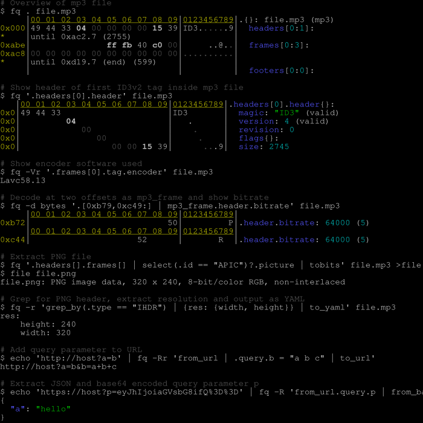

# fq

Tool, language and decoders for working with binary formats.



Basic usage is `fq . file`, `fq d file` or `fq 'some query' file ...`.

For details see [the manual](https://wader.github.io/fq/), also available as `man fq` and as [AsciiDoc](doc/fq.1.adoc).

### Background

fq is a tool, language, and decoders for working with binary formats and data.
In most cases it behaves and feels similar to [jq](https://jqlang.github.io/jq/) and it
also uses the same expression language.
To get the most out of fq it's recommended to learn more about jq.

It features a structural hex viewer, nested format decoding, slicing and concatenating
binary data, bit-level decoding and an interactive REPL with auto-completion.

### Goals

- Make binaries more accessible, queryable and sliceable.
- Nested formats and bit-oriented decoding.
- Quick and comfortable CLI tool.
- Bits and bytes transformations.

### Hopes

- Make it useful enough that people want to help improve it.
- Inspire people to create similar tools.

### Supported formats

[fq -rn -L doc 'include "formats"; formats_list']: sh-start

aac_frame,
adts,
adts_frame,
aiff,
amf0,
apev2,
apple_bookmark,
ar,
asn1_ber,
av1_ccr,
av1_frame,
av1_obu,
avc_annexb,
avc_au,
avc_dcr,
avc_nalu,
avc_pps,
avc_sei,
avc_sps,
avi,
avro_ocf,
bencode,
bitcoin_blkdat,
bitcoin_block,
bitcoin_script,
bitcoin_transaction,
bits,
bplist,
bsd_loopback_frame,
bson,
bytes,
bzip2,
caff,
cbor,
csv,
dns,
dns_tcp,
elf,
ether8023_frame,
exif,
fairplay_spc,
fit,
flac,
flac_frame,
flac_metadatablock,
flac_metadatablocks,
flac_picture,
flac_streaminfo,
gif,
gzip,
heif,
hevc_annexb,
hevc_au,
hevc_dcr,
hevc_nalu,
hevc_pps,
hevc_sps,
hevc_vps,
html,
icc_profile,
icmp,
icmpv6,
id3v1,
id3v11,
id3v2,
ipv4_packet,
ipv6_packet,
jp2c,
jpeg,
json,
jsonl,
leveldb_descriptor,
leveldb_log,
leveldb_table,
luajit,
macho,
macho_fat,
markdown,
matroska,
midi,
moc3,
mosaic,
mp3,
mp3_frame,
mp3_frame_vbri,
mp3_frame_xing,
mp4,
mpeg_asc,
mpeg_es,
mpeg_pes,
mpeg_pes_packet,
mpeg_spu,
mpeg_ts,
msgpack,
negentropy,
nes,
ogg,
ogg_page,
opentimestamps,
opus_packet,
pcap,
pcapng,
pg_btree,
pg_control,
pg_heap,
png,
prores_frame,
protobuf,
protobuf_widevine,
pssh_playready,
rtmp,
safetensors,
sll2_packet,
sll_packet,
stl,
tap,
tar,
tcp_segment,
tiff,
tls,
toml,
tzif,
tzx,
udp_datagram,
vorbis_comment,
vorbis_packet,
vp8_frame,
vp9_cfm,
vp9_frame,
vpx_ccr,
wasm,
wav,
webp,
xml,
yaml,
zip

[#]: sh-end

It can also work with some common text formats like URLs, hex, base64, PEM etc and for some serialization formats like XML, YAML, etc. it can transform both from and to jq values.

For details see [the manual](https://wader.github.io/fq/).

## Presentations and media

- [PBS Tidbit 8 of Y: Interview with jq Maintainer Mattias Wadman](https://pbs.bartificer.net/tidbit8) - English podcast episode about jq and some fq.
- [Kodsnack 585 - Polymorfisk JSON](https://kodsnack.se/585/) - Swedish podcast episode about jq and fq
- "fq - jq for binary formats" at [FOSDEM 2023](https://fosdem.org/2023/) - [video & slides](https://fosdem.org/2023/schedule/event/bintools_fq/)
- "fq - jq for binary formats" at [No time to wait 6](https://mediaarea.net/NoTimeToWait6) - [video](https://www.youtube.com/watch?v=-Pwt5KL-xRs&t=1450s) - [slides](doc/presentations/nttw6/fq-nttw6-slides.pdf)
- "fq - jq for binary formats" at [Binary Tools Summit 2022](https://binary-tools.net/summit.html) - [video](https://www.youtube.com/watch?v=GJOq_b0eb-s&list=PLTj8twuHdQz-JcX7k6eOwyVPDB8CyfZc8&index=1) - [slides](doc/presentations/bts2022/fq-bts2022-v1.pdf)

## Install

Use one of the methods listed below or download a pre-built [release](https://github.com/wader/fq/releases) for macOS, Linux or Windows. Unarchive it and move the executable to `PATH` etc.

On macOS if you don't install using one of the method below then you might have to manually allow the binary to run. This can be done by trying to run the binary, ignore the warning and then go into security preference and allow it. Same can be done with these commands:

```sh
xattr -d com.apple.quarantine fq
# for macOS version before Sequoia you might need this also
spctl --add fq
```

### Homebrew (macOS)

```sh
brew install wader/tap/fq
```

### MacPorts

On macOS, `fq` can also be installed via [MacPorts](https://www.macports.org).  More details [here](https://ports.macports.org/port/fq/).

```sh
sudo port install fq
```

### Windows

`fq` can be installed via [scoop](https://scoop.sh/).

```powershell
scoop install fq
```

### Arch Linux

`fq` can be installed from the [extra repository](https://archlinux.org/packages/extra/x86_64/fq/) using [pacman](https://wiki.archlinux.org/title/Pacman):

```sh
pacman -S fq
```

You can also build and install the development (VCS) package using an [AUR helper](https://wiki.archlinux.org/index.php/AUR_helpers):

```sh
paru -S fq-git
```

### Gentoo

`fq` can be installed from the Gentoo package repository using `emerge`:

```sh
emerge dev-util/fq
```

### Guix

```sh
guix shell fq -- fq --help # in develompen shell
guix install fq            # into current profile
```

### Nix

```sh
nix-shell -p fq
```

### FreeBSD

Use the [fq](https://cgit.freebsd.org/ports/tree/misc/fq) port.

### Alpine

Currently in edge testing but should work fine in stable also.

```
apk add -X http://dl-cdn.alpinelinux.org/alpine/edge/testing fq
```

### Build from source

Make sure you have [go](https://go.dev) 1.22 or later installed.

To install directly from git repository (no git clone needed):
```sh
# build and install latest release
go install github.com/wader/fq@latest

# build and install latest master
go install github.com/wader/fq@master

# copy binary to $PATH if needed
cp "$(go env GOPATH)/bin/fq" /usr/local/bin
```

To build, run and test from source:
```sh
# build and run
go run .
# build and run with arguments
go run . -d mp3 . file.mp3
# just build
go build -o fq .
# run all tests and build binary
make test fq
```

## Development and adding a new decoder

See [dev.md](doc/dev.md)

## Thanks and related projects

This project would not have been possible without [itchyny](https://github.com/itchyny)'s
jq implementation [gojq](https://github.com/itchyny/gojq). I also want to thank
[HexFiend](https://github.com/HexFiend/HexFiend) for inspiration and ideas and [stedolan](https://github.com/stedolan)
for inventing the [jq](https://github.com/stedolan/jq) language.

### Similar or related works

#### Tools

- [HexFiend](https://github.com/HexFiend/HexFiend) - Hex editor for macOS with format template support.
- [ImHex](https://github.com/WerWolv/ImHex) - A Hex Editor for Reverse Engineers.
- [binspector](https://github.com/binspector/binspector) - Binary format analysis tool with query language and REPL.
- [kaitai](https://kaitai.io) - Declarative binary format parsing.
- [Wireshark](https://www.wireshark.org) - Decodes network traffic (tip: `tshark -T json`).
- [MediaInfo](https://mediaarea.net/en/MediaInfo) - Analyze media files  (tip `mediainfo --Output=JSON` and `mediainfo --Details=1`).
- [GNU poke](https://www.jemarch.net/poke) - The extensible editor for structured binary data.
- [ffmpeg/ffprobe](https://ffmpeg.org) - Powerful media libraries and tools.
- [hexdump](https://git.kernel.org/pub/scm/utils/util-linux/util-linux.git/tree/text-utils/hexdump.c) - Hex viewer tool.
- [hex](https://git.janouch.name/p/hex) - Interactive hex viewer with format support via lua.
- [hachoir](https://github.com/vstinner/hachoir) - General python library for working binary data.
- [scapy](https://scapy.net) - Decode/Encode formats, focus on network protocols.

#### Projects and Standards

- [Let's Solve the File Format Problem](http://fileformats.archiveteam.org).
- [PRONOM](https://www.nationalarchives.gov.uk/PRONOM/) file format registry.
- [Sustainability of Digital Formats](https://www.loc.gov/preservation/digital/formats/) at Library of Congress.
- [Data Format Description Language (DFDL)](https://en.wikipedia.org/wiki/Data_Format_Description_Language).

## TODO and ideas

See [TODO.md](doc/TODO.md)

## License

`fq` is distributed under the terms of the MIT License.

See the [LICENSE](LICENSE) file for license details.

Licenses of direct dependencies:

- Forked version of gojq - https://github.com/itchyny/gojq/blob/main/LICENSE (MIT)
- github.com/ergochat/readline - https://github.com/ergochat/readline/blob/master/LICENSE (MIT)
- github.com/BurntSushi/toml - https://github.com/BurntSushi/toml/blob/master/COPYING (MIT)
- github.com/creasty/defaults - https://github.com/creasty/defaults/blob/master/LICENSE (MIT)
- github.com/gomarkdown/markdown - https://github.com/gomarkdown/markdown/blob/master/LICENSE.txt (BSD)
- github.com/gopacket/gopacket - https://github.com/gopacket/gopacket/blob/master/LICENSE (BSD)
- github.com/mitchellh/copystructure - https://github.com/mitchellh/copystructure/blob/master/LICENSE (MIT)
- github.com/mitchellh/mapstructure - https://github.com/mitchellh/mapstructure/blob/master/LICENSE (MIT)
- github.com/pmezard/go-difflib - https://github.com/pmezard/go-difflib/blob/master/LICENSE (BSD)
- golang/snappy - https://github.com/golang/snappy/blob/master/LICENSE (BSD)
- golang/x/* - https://github.com/golang/text/blob/master/LICENSE (BSD)
- gopkg.in/yaml.v3 - https://github.com/go-yaml/yaml/blob/v3/LICENSE (MIT)
- Parts of go crypto/tls and github.com/zmap/zcrypto - https://github.com/zmap/zcrypto/blob/master/LICENSE (Apache)
