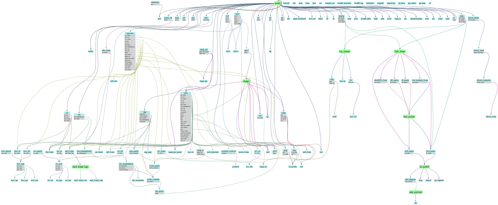

## Supported formats

[fq -rn -L . 'include "formats"; formats_table']: sh-start

|Name                                                            |Description                                                                                                  |Dependencies|
|-                                                               |-                                                                                                            |-|
|[`aac_frame`](#aac_frame)                                       |Advanced&nbsp;Audio&nbsp;Coding&nbsp;frame                                                                   |<sub></sub>|
|`adts`                                                          |Audio&nbsp;Data&nbsp;Transport&nbsp;Stream                                                                   |<sub>`adts_frame`</sub>|
|`adts_frame`                                                    |Audio&nbsp;Data&nbsp;Transport&nbsp;Stream&nbsp;frame                                                        |<sub>`aac_frame`</sub>|
|`aiff`                                                          |Audio&nbsp;Interchange&nbsp;File&nbsp;Format                                                                 |<sub></sub>|
|`amf0`                                                          |Action&nbsp;Message&nbsp;Format&nbsp;0                                                                       |<sub></sub>|
|`apev2`                                                         |APEv2&nbsp;metadata&nbsp;tag                                                                                 |<sub>`image`</sub>|
|[`apple_bookmark`](#apple_bookmark)                             |Apple&nbsp;BookmarkData                                                                                      |<sub></sub>|
|`ar`                                                            |Unix&nbsp;archive                                                                                            |<sub>`probe`</sub>|
|[`asn1_ber`](#asn1_ber)                                         |ASN1&nbsp;BER&nbsp;(basic&nbsp;encoding&nbsp;rules,&nbsp;also&nbsp;CER&nbsp;and&nbsp;DER)                    |<sub></sub>|
|`av1_ccr`                                                       |AV1&nbsp;Codec&nbsp;Configuration&nbsp;Record                                                                |<sub>`av1_obu`</sub>|
|`av1_frame`                                                     |AV1&nbsp;frame                                                                                               |<sub>`av1_obu`</sub>|
|`av1_obu`                                                       |AV1&nbsp;Open&nbsp;Bitstream&nbsp;Unit                                                                       |<sub></sub>|
|`avc_annexb`                                                    |H.264/AVC&nbsp;Annex&nbsp;B                                                                                  |<sub>`avc_nalu`</sub>|
|[`avc_au`](#avc_au)                                             |H.264/AVC&nbsp;Access&nbsp;Unit                                                                              |<sub>`avc_nalu`</sub>|
|`avc_dcr`                                                       |H.264/AVC&nbsp;Decoder&nbsp;Configuration&nbsp;Record                                                        |<sub>`avc_nalu`</sub>|
|`avc_nalu`                                                      |H.264/AVC&nbsp;Network&nbsp;Access&nbsp;Layer&nbsp;Unit                                                      |<sub>`avc_sps` `avc_pps` `avc_sei`</sub>|
|`avc_pps`                                                       |H.264/AVC&nbsp;Picture&nbsp;Parameter&nbsp;Set                                                               |<sub></sub>|
|`avc_sei`                                                       |H.264/AVC&nbsp;Supplemental&nbsp;Enhancement&nbsp;Information                                                |<sub></sub>|
|`avc_sps`                                                       |H.264/AVC&nbsp;Sequence&nbsp;Parameter&nbsp;Set                                                              |<sub></sub>|
|[`avi`](#avi)                                                   |Audio&nbsp;Video&nbsp;Interleaved                                                                            |<sub>`avc_au` `hevc_au` `mp3_frame` `flac_frame`</sub>|
|[`avro_ocf`](#avro_ocf)                                         |Avro&nbsp;object&nbsp;container&nbsp;file                                                                    |<sub></sub>|
|[`bencode`](#bencode)                                           |BitTorrent&nbsp;bencoding                                                                                    |<sub></sub>|
|`bitcoin_blkdat`                                                |Bitcoin&nbsp;blk.dat                                                                                         |<sub>`bitcoin_block`</sub>|
|[`bitcoin_block`](#bitcoin_block)                               |Bitcoin&nbsp;block                                                                                           |<sub>`bitcoin_transaction`</sub>|
|`bitcoin_script`                                                |Bitcoin&nbsp;script                                                                                          |<sub></sub>|
|`bitcoin_transaction`                                           |Bitcoin&nbsp;transaction                                                                                     |<sub>`bitcoin_script`</sub>|
|[`bits`](#bits)                                                 |Raw&nbsp;bits                                                                                                |<sub></sub>|
|[`bplist`](#bplist)                                             |Apple&nbsp;Binary&nbsp;Property&nbsp;List                                                                    |<sub></sub>|
|`bsd_loopback_frame`                                            |BSD&nbsp;loopback&nbsp;frame                                                                                 |<sub>`inet_packet`</sub>|
|[`bson`](#bson)                                                 |Binary&nbsp;JSON                                                                                             |<sub></sub>|
|[`bytes`](#bytes)                                               |Raw&nbsp;bytes                                                                                               |<sub></sub>|
|`bzip2`                                                         |bzip2&nbsp;compression                                                                                       |<sub>`probe`</sub>|
|[`caff`](#caff)                                                 |Live2D&nbsp;Cubism&nbsp;archive                                                                              |<sub>`probe`</sub>|
|[`cbor`](#cbor)                                                 |Concise&nbsp;Binary&nbsp;Object&nbsp;Representation                                                          |<sub></sub>|
|[`csv`](#csv)                                                   |Comma&nbsp;separated&nbsp;values                                                                             |<sub></sub>|
|`dns`                                                           |DNS&nbsp;packet                                                                                              |<sub></sub>|
|`dns_tcp`                                                       |DNS&nbsp;packet&nbsp;(TCP)                                                                                   |<sub></sub>|
|`elf`                                                           |Executable&nbsp;and&nbsp;Linkable&nbsp;Format                                                                |<sub></sub>|
|`ether8023_frame`                                               |Ethernet&nbsp;802.3&nbsp;frame                                                                               |<sub>`inet_packet`</sub>|
|`exif`                                                          |Exchangeable&nbsp;Image&nbsp;File&nbsp;Format                                                                |<sub></sub>|
|`fairplay_spc`                                                  |FairPlay&nbsp;Server&nbsp;Playback&nbsp;Context                                                              |<sub></sub>|
|[`fit`](#fit)                                                   |Garmin&nbsp;Flexible&nbsp;and&nbsp;Interoperable&nbsp;Data&nbsp;Transfer                                     |<sub></sub>|
|`flac`                                                          |Free&nbsp;Lossless&nbsp;Audio&nbsp;Codec&nbsp;file                                                           |<sub>`flac_metadatablocks` `flac_frame`</sub>|
|[`flac_frame`](#flac_frame)                                     |FLAC&nbsp;frame                                                                                              |<sub></sub>|
|`flac_metadatablock`                                            |FLAC&nbsp;metadatablock                                                                                      |<sub>`flac_streaminfo` `flac_picture` `vorbis_comment`</sub>|
|`flac_metadatablocks`                                           |FLAC&nbsp;metadatablocks                                                                                     |<sub>`flac_metadatablock`</sub>|
|`flac_picture`                                                  |FLAC&nbsp;metadatablock&nbsp;picture                                                                         |<sub>`image`</sub>|
|`flac_streaminfo`                                               |FLAC&nbsp;streaminfo                                                                                         |<sub></sub>|
|`gif`                                                           |Graphics&nbsp;Interchange&nbsp;Format                                                                        |<sub></sub>|
|`gzip`                                                          |gzip&nbsp;compression                                                                                        |<sub>`probe`</sub>|
|`hevc_annexb`                                                   |H.265/HEVC&nbsp;Annex&nbsp;B                                                                                 |<sub>`hevc_nalu`</sub>|
|[`hevc_au`](#hevc_au)                                           |H.265/HEVC&nbsp;Access&nbsp;Unit                                                                             |<sub>`hevc_nalu`</sub>|
|`hevc_dcr`                                                      |H.265/HEVC&nbsp;Decoder&nbsp;Configuration&nbsp;Record                                                       |<sub>`hevc_nalu`</sub>|
|`hevc_nalu`                                                     |H.265/HEVC&nbsp;Network&nbsp;Access&nbsp;Layer&nbsp;Unit                                                     |<sub>`hevc_vps` `hevc_pps` `hevc_sps`</sub>|
|`hevc_pps`                                                      |H.265/HEVC&nbsp;Picture&nbsp;Parameter&nbsp;Set                                                              |<sub></sub>|
|`hevc_sps`                                                      |H.265/HEVC&nbsp;Sequence&nbsp;Parameter&nbsp;Set                                                             |<sub></sub>|
|`hevc_vps`                                                      |H.265/HEVC&nbsp;Video&nbsp;Parameter&nbsp;Set                                                                |<sub></sub>|
|[`html`](#html)                                                 |HyperText&nbsp;Markup&nbsp;Language                                                                          |<sub></sub>|
|`icc_profile`                                                   |International&nbsp;Color&nbsp;Consortium&nbsp;profile                                                        |<sub></sub>|
|`icmp`                                                          |Internet&nbsp;Control&nbsp;Message&nbsp;Protocol                                                             |<sub></sub>|
|`icmpv6`                                                        |Internet&nbsp;Control&nbsp;Message&nbsp;Protocol&nbsp;v6                                                     |<sub></sub>|
|`id3v1`                                                         |ID3v1&nbsp;metadata                                                                                          |<sub></sub>|
|`id3v11`                                                        |ID3v1.1&nbsp;metadata                                                                                        |<sub></sub>|
|`id3v2`                                                         |ID3v2&nbsp;metadata                                                                                          |<sub>`image`</sub>|
|`ipv4_packet`                                                   |Internet&nbsp;protocol&nbsp;v4&nbsp;packet                                                                   |<sub>`ip_packet`</sub>|
|`ipv6_packet`                                                   |Internet&nbsp;protocol&nbsp;v6&nbsp;packet                                                                   |<sub>`ip_packet`</sub>|
|`jp2c`                                                          |JPEG&nbsp;2000&nbsp;codestream                                                                               |<sub></sub>|
|`jpeg`                                                          |Joint&nbsp;Photographic&nbsp;Experts&nbsp;Group&nbsp;file                                                    |<sub>`exif` `icc_profile`</sub>|
|`json`                                                          |JavaScript&nbsp;Object&nbsp;Notation                                                                         |<sub></sub>|
|`jsonl`                                                         |JavaScript&nbsp;Object&nbsp;Notation&nbsp;Lines                                                              |<sub></sub>|
|[`leveldb_descriptor`](#leveldb_descriptor)                     |LevelDB&nbsp;Descriptor                                                                                      |<sub></sub>|
|[`leveldb_log`](#leveldb_log)                                   |LevelDB&nbsp;Log                                                                                             |<sub></sub>|
|[`leveldb_table`](#leveldb_table)                               |LevelDB&nbsp;Table                                                                                           |<sub></sub>|
|[`luajit`](#luajit)                                             |LuaJIT&nbsp;2.0&nbsp;bytecode                                                                                |<sub></sub>|
|[`macho`](#macho)                                               |Mach-O&nbsp;macOS&nbsp;executable                                                                            |<sub></sub>|
|`macho_fat`                                                     |Fat&nbsp;Mach-O&nbsp;macOS&nbsp;executable&nbsp;(multi-architecture)                                         |<sub>`macho`</sub>|
|[`markdown`](#markdown)                                         |Markdown                                                                                                     |<sub></sub>|
|[`matroska`](#matroska)                                         |Matroska&nbsp;file                                                                                           |<sub>`aac_frame` `av1_ccr` `av1_frame` `avc_au` `avc_dcr` `flac_frame` `flac_metadatablocks` `hevc_au` `hevc_dcr` `image` `mp3_frame` `mpeg_asc` `mpeg_pes_packet` `mpeg_spu` `opus_packet` `vorbis_packet` `vp8_frame` `vp9_cfm` `vp9_frame`</sub>|
|[`midi`](#midi)                                                 |Standard&nbsp;MIDI&nbsp;file                                                                                 |<sub></sub>|
|[`moc3`](#moc3)                                                 |MOC3&nbsp;file                                                                                               |<sub></sub>|
|[`mp3`](#mp3)                                                   |MP3&nbsp;file                                                                                                |<sub>`id3v2` `id3v1` `id3v11` `apev2` `mp3_frame`</sub>|
|`mp3_frame`                                                     |MPEG&nbsp;audio&nbsp;layer&nbsp;3&nbsp;frame                                                                 |<sub>`mp3_frame_tags`</sub>|
|`mp3_frame_vbri`                                                |MP3&nbsp;frame&nbsp;Fraunhofer&nbsp;encoder&nbsp;variable&nbsp;bitrate&nbsp;tag                              |<sub></sub>|
|`mp3_frame_xing`                                                |MP3&nbsp;frame&nbsp;Xing/Info&nbsp;tag                                                                       |<sub></sub>|
|[`mp4`](#mp4)                                                   |ISOBMFF,&nbsp;QuickTime&nbsp;and&nbsp;similar                                                                |<sub>`aac_frame` `av1_ccr` `av1_frame` `avc_au` `avc_dcr` `flac_frame` `flac_metadatablocks` `hevc_au` `hevc_dcr` `icc_profile` `id3v2` `image` `jp2c` `jpeg` `mp3_frame` `mpeg_es` `mpeg_pes_packet` `opus_packet` `png` `prores_frame` `protobuf_widevine` `pssh_playready` `vorbis_packet` `vp9_frame` `vpx_ccr`</sub>|
|`mpeg_asc`                                                      |MPEG-4&nbsp;Audio&nbsp;Specific&nbsp;Config                                                                  |<sub></sub>|
|`mpeg_es`                                                       |MPEG&nbsp;Elementary&nbsp;Stream                                                                             |<sub>`mpeg_asc` `vorbis_packet`</sub>|
|`mpeg_pes`                                                      |MPEG&nbsp;Packetized&nbsp;elementary&nbsp;stream                                                             |<sub>`mpeg_pes_packet` `mpeg_spu`</sub>|
|`mpeg_pes_packet`                                               |MPEG&nbsp;Packetized&nbsp;elementary&nbsp;stream&nbsp;packet                                                 |<sub></sub>|
|`mpeg_spu`                                                      |Sub&nbsp;Picture&nbsp;Unit&nbsp;(DVD&nbsp;subtitle)                                                          |<sub></sub>|
|`mpeg_ts`                                                       |MPEG&nbsp;Transport&nbsp;Stream                                                                              |<sub></sub>|
|[`msgpack`](#msgpack)                                           |MessagePack                                                                                                  |<sub></sub>|
|[`negentropy`](#negentropy)                                     |Negentropy&nbsp;message                                                                                      |<sub></sub>|
|[`nes`](#nes)                                                   |iNES/NES&nbsp;2.0&nbsp;cartridge&nbsp;ROM&nbsp;format                                                        |<sub></sub>|
|`ogg`                                                           |OGG&nbsp;file                                                                                                |<sub>`ogg_page` `vorbis_packet` `opus_packet` `flac_metadatablock` `flac_frame`</sub>|
|`ogg_page`                                                      |OGG&nbsp;page                                                                                                |<sub></sub>|
|[`opentimestamps`](#opentimestamps)                             |OpenTimestamps&nbsp;file                                                                                     |<sub></sub>|
|`opus_packet`                                                   |Opus&nbsp;packet                                                                                             |<sub>`vorbis_comment`</sub>|
|[`pcap`](#pcap)                                                 |PCAP&nbsp;packet&nbsp;capture                                                                                |<sub>`link_frame` `tcp_stream` `ipv4_packet`</sub>|
|`pcapng`                                                        |PCAPNG&nbsp;packet&nbsp;capture                                                                              |<sub>`link_frame` `tcp_stream` `ipv4_packet`</sub>|
|[`pg_btree`](#pg_btree)                                         |PostgreSQL&nbsp;btree&nbsp;index&nbsp;file                                                                   |<sub></sub>|
|[`pg_control`](#pg_control)                                     |PostgreSQL&nbsp;control&nbsp;file                                                                            |<sub></sub>|
|[`pg_heap`](#pg_heap)                                           |PostgreSQL&nbsp;heap&nbsp;file                                                                               |<sub></sub>|
|`png`                                                           |Portable&nbsp;Network&nbsp;Graphics&nbsp;file                                                                |<sub>`icc_profile` `exif`</sub>|
|`prores_frame`                                                  |Apple&nbsp;ProRes&nbsp;frame                                                                                 |<sub></sub>|
|[`protobuf`](#protobuf)                                         |Protobuf                                                                                                     |<sub></sub>|
|`protobuf_widevine`                                             |Widevine&nbsp;protobuf                                                                                       |<sub>`protobuf`</sub>|
|`pssh_playready`                                                |PlayReady&nbsp;PSSH                                                                                          |<sub></sub>|
|[`rtmp`](#rtmp)                                                 |Real-Time&nbsp;Messaging&nbsp;Protocol                                                                       |<sub>`amf0` `mpeg_asc`</sub>|
|`sll2_packet`                                                   |Linux&nbsp;cooked&nbsp;capture&nbsp;encapsulation&nbsp;v2                                                    |<sub>`inet_packet`</sub>|
|`sll_packet`                                                    |Linux&nbsp;cooked&nbsp;capture&nbsp;encapsulation                                                            |<sub>`inet_packet`</sub>|
|[`tap`](#tap)                                                   |TAP&nbsp;tape&nbsp;format&nbsp;for&nbsp;ZX&nbsp;Spectrum&nbsp;computers                                      |<sub></sub>|
|`tar`                                                           |Tar&nbsp;archive                                                                                             |<sub>`probe`</sub>|
|`tcp_segment`                                                   |Transmission&nbsp;control&nbsp;protocol&nbsp;segment                                                         |<sub></sub>|
|`tiff`                                                          |Tag&nbsp;Image&nbsp;File&nbsp;Format                                                                         |<sub>`icc_profile`</sub>|
|[`tls`](#tls)                                                   |Transport&nbsp;layer&nbsp;security                                                                           |<sub>`asn1_ber`</sub>|
|`toml`                                                          |Tom's&nbsp;Obvious,&nbsp;Minimal&nbsp;Language                                                               |<sub></sub>|
|[`tzif`](#tzif)                                                 |Time&nbsp;Zone&nbsp;Information&nbsp;Format                                                                  |<sub></sub>|
|[`tzx`](#tzx)                                                   |TZX&nbsp;tape&nbsp;format&nbsp;for&nbsp;ZX&nbsp;Spectrum&nbsp;computers                                      |<sub>`tap`</sub>|
|`udp_datagram`                                                  |User&nbsp;datagram&nbsp;protocol                                                                             |<sub>`udp_payload`</sub>|
|`vorbis_comment`                                                |Vorbis&nbsp;comment                                                                                          |<sub>`flac_picture`</sub>|
|`vorbis_packet`                                                 |Vorbis&nbsp;packet                                                                                           |<sub>`vorbis_comment`</sub>|
|`vp8_frame`                                                     |VP8&nbsp;frame                                                                                               |<sub></sub>|
|`vp9_cfm`                                                       |VP9&nbsp;Codec&nbsp;Feature&nbsp;Metadata                                                                    |<sub></sub>|
|`vp9_frame`                                                     |VP9&nbsp;frame                                                                                               |<sub></sub>|
|`vpx_ccr`                                                       |VPX&nbsp;Codec&nbsp;Configuration&nbsp;Record                                                                |<sub></sub>|
|[`wasm`](#wasm)                                                 |WebAssembly&nbsp;Binary&nbsp;Format                                                                          |<sub></sub>|
|`wav`                                                           |WAV&nbsp;file                                                                                                |<sub>`id3v2` `id3v1` `id3v11`</sub>|
|`webp`                                                          |WebP&nbsp;image                                                                                              |<sub>`exif` `vp8_frame` `icc_profile` `xml`</sub>|
|[`xml`](#xml)                                                   |Extensible&nbsp;Markup&nbsp;Language                                                                         |<sub></sub>|
|`yaml`                                                          |YAML&nbsp;Ain't&nbsp;Markup&nbsp;Language                                                                    |<sub></sub>|
|[`zip`](#zip)                                                   |ZIP&nbsp;archive                                                                                             |<sub>`probe`</sub>|
|`image`                                                         |Group                                                                                                        |<sub>`gif` `jp2c` `jpeg` `mp4` `png` `tiff` `webp`</sub>|
|`inet_packet`                                                   |Group                                                                                                        |<sub>`ipv4_packet` `ipv6_packet`</sub>|
|`ip_packet`                                                     |Group                                                                                                        |<sub>`icmp` `icmpv6` `tcp_segment` `udp_datagram`</sub>|
|`link_frame`                                                    |Group                                                                                                        |<sub>`bsd_loopback_frame` `ether8023_frame` `ipv4_packet` `ipv6_packet` `sll2_packet` `sll_packet`</sub>|
|`mp3_frame_tags`                                                |Group                                                                                                        |<sub>`mp3_frame_vbri` `mp3_frame_xing`</sub>|
|`probe`                                                         |Group                                                                                                        |<sub>`adts` `aiff` `apple_bookmark` `ar` `avi` `avro_ocf` `bitcoin_blkdat` `bplist` `bzip2` `caff` `elf` `fit` `flac` `gif` `gzip` `html` `jp2c` `jpeg` `json` `jsonl` `leveldb_table` `luajit` `macho` `macho_fat` `matroska` `midi` `moc3` `mp3` `mp4` `mpeg_ts` `nes` `ogg` `opentimestamps` `pcap` `pcapng` `png` `tar` `tiff` `toml` `tzif` `tzx` `wasm` `wav` `webp` `xml` `yaml` `zip`</sub>|
|`tcp_stream`                                                    |Group                                                                                                        |<sub>`dns_tcp` `rtmp` `tls`</sub>|
|`udp_payload`                                                   |Group                                                                                                        |<sub>`dns`</sub>|

[#]: sh-end

## Global format options

Currently the only global option is `force` and is used to ignore some format assertion errors. It can be used as a decode option or as a CLI `-o` option:

```
fq -d mp4 -o force=true file.mp4
fq -d bytes 'mp4({force: true})' file.mp4
```

## Format details

[fq -rn -L . 'include "formats"; formats_sections']: sh-start

## aac_frame
Advanced Audio Coding frame.

### Options

|Name         |Default|Description|
|-            |-      |-|
|`object_type`|1      |Audio object type|

### Examples

Decode file using aac_frame options
```
$ fq -d aac_frame -o object_type=1 . file
```

Decode value as aac_frame
```
... | aac_frame({object_type:1})
```

## apple_bookmark
Apple BookmarkData.

Apple's `bookmarkData` format is used to encode information that can be resolved
into a `URL` object for a file even if the user moves or renames it. Can also
contain security scoping information for App Sandbox support.

These `bookmarkData` blobs are often found endcoded in data fields of Binary
Property Lists. Notable examples include:

- `com.apple.finder.plist` - contains an `FXRecentFolders` value, which is an
  array of ten objects, each of which consists of a `name` and `file-bookmark`
  field, which is a `bookmarkData` object for each recently accessed folder
  location.

- `com.apple.LSSharedFileList.RecentApplications.sfl2` - `sfl2` files are
  actually `plist` files of the `NSKeyedArchiver` format. They can be parsed the
  same as `plist` files, but they have a more complicated tree-like structure
  than would typically be found, which can make locating and retrieving specific
  values difficult, even once it has been converted to a JSON representation.
  For more information about these types of files, see Sarah Edwards' excellent
  research on the subject (link in references).

`fq`'s `grep_by` function can be used to recursively descend through the decoded
tree, probing for and selecting any `bookmark` blobs, then converting them to
readable JSON with `torepr`:
```
fq 'grep_by(.type=="data" and .value[0:4] == "book") | .value | apple_bookmark |
torepr' <sfl2 file>
```

### Authors
- David McDonald
[@dgmcdona](https://github.com/dgmcdona)
[@river_rat_504](https://twitter.com/river_rat_504)

### References
- https://developer.apple.com/documentation/foundation/url/2143023-bookmarkdata
- https://mac-alias.readthedocs.io/en/latest/bookmark_fmt.html
- https://www.mac4n6.com/blog/2016/1/1/manual-analysis-of-nskeyedarchiver-formatted-plist-files-a-review-of-the-new-os-x-1011-recent-items
- https://michaellynn.github.io/2015/10/24/apples-bookmarkdata-exposed/

## asn1_ber
ASN1 BER (basic encoding rules, also CER and DER).

Supports decoding BER, CER and DER (X.690).

- Currently no extra validation is done for CER and DER.
- Does not support specifying a schema.
- Supports `torepr` but without schema all sequences and sets will be arrays.

### Can be used to decode certificates etc

```sh
$ fq -d bytes 'from_pem | asn1_ber | d' cert.pem
```

### Can decode nested values

```sh
$ fq -d asn1_ber '.constructed[1].value | asn1_ber' file.ber
```

### Manual schema

```sh
$ fq -d asn1_ber 'torepr as $r | ["version", "modulus", "private_exponent", "private_exponen", "prime1", "prime2", "exponent1", "exponent2", "coefficient"] | with_entries({key: .value, value: $r[.key]})' pkcs1.der
```

### References
- https://www.itu.int/ITU-T/studygroups/com10/languages/X.690_1297.pdf
- https://en.wikipedia.org/wiki/X.690
- https://letsencrypt.org/docs/a-warm-welcome-to-asn1-and-der/
- https://lapo.it/asn1js/

## avc_au
H.264/AVC Access Unit.

### Options

|Name         |Default|Description|
|-            |-      |-|
|`length_size`|0      |Length value size|

### Examples

Decode file using avc_au options
```
$ fq -d avc_au -o length_size=0 . file
```

Decode value as avc_au
```
... | avc_au({length_size:0})
```

## avi
Audio Video Interleaved.

### Options

|Name                    |Default|Description|
|-                       |-      |-|
|`decode_extended_chunks`|true   |Decode extended chunks|
|`decode_samples`        |true   |Decode samples|

### Examples

Decode file using avi options
```
$ fq -d avi -o decode_extended_chunks=true -o decode_samples=true . file
```

Decode value as avi
```
... | avi({decode_extended_chunks:true,decode_samples:true})
```

### Samples

AVI has many redundant ways to index samples so currently `.streams[].samples` will only include samples the most "modern" way used in the file. That is in order of stream super index, movi ix index then idx1 index.

### Extract samples for stream 1

```sh
$ fq '.streams[1].samples[] | tobytes' file.avi > stream01.mp3
```

### Show stream summary
```sh
$ fq -o decode_samples=false '[.chunks[0] | grep_by(.id=="LIST" and .type=="strl") | grep_by(.id=="strh") as {$type} | grep_by(.id=="strf") as {$format_tag, $compression} | {$type,$format_tag,$compression}]' *.avi
```

### Speed up decoding by disabling sample and extended chunks decoding

If your not interested in sample details or extended chunks you can speed up decoding by using:
```sh
$ fq -o decode_samples=false -o decode_extended_chunks=false d file.avi
```

### References

- [AVI RIFF File Reference](https://learn.microsoft.com/en-us/windows/win32/directshow/avi-riff-file-reference)
- [OpenDML AVI File Format Extensions](http://www.jmcgowan.com/odmlff2.pdf)

## avro_ocf
Avro object container file.

Supports reading Avro Object Container Format (OCF) files based on the 1.11.0 specification.

Capable of handling null, deflate, and snappy codecs for data compression.

Limitations:

- Schema does not support self-referential types, only built-in types.
- Decimal logical types are not supported for decoding, will just be treated as their primitive type

### References
- https://avro.apache.org/docs/current/spec.html#Object+Container+Files

### Authors
- Xentripetal
xentripetal@fastmail.com
[@xentripetal](https://github.com/xentripetal)

## bencode
BitTorrent bencoding.

### Convert represented value to JSON

```
$ fq -d bencode torepr file.torrent
```

### References
- https://wiki.theory.org/BitTorrentSpecification#Bencoding

## bitcoin_block
Bitcoin block.

### Options

|Name        |Default|Description|
|-           |-      |-|
|`has_header`|false  |Has blkdat header|

### Examples

Decode file using bitcoin_block options
```
$ fq -d bitcoin_block -o has_header=false . file
```

Decode value as bitcoin_block
```
... | bitcoin_block({has_header:false})
```

## bits
Raw bits.

Decode to a slice and indexable binary of bits.

### Slice and decode bit range

```sh
$ echo 'some {"a":1} json' | fq -d bits '.[40:-48] | fromjson'
{
  "a": 1
}
```

## Index bits

```sh
✗ echo 'hello' | fq -d bits '.[4]'
1
$ echo 'hello' | fq -c -d bits '[.[range(8)]]'
[0,1,1,0,1,0,0,0]
```

## bplist
Apple Binary Property List.

### Show full decoding
```sh
$ fq d Info.plist
```

### Timestamps
Timestamps in Apple Binary Property Lists are encoded as Cocoa Core Data
timestamps, where the raw value is the floating point number of seconds since
January 1, 2001. By default, `fq` will render the raw floating point value. In
order to get the raw value or string description, use the `todescription`
function, you can use the `tovalue` and `todescription` functions:

```sh
$ fq 'torepr.SomeTimeStamp | tovalue' Info.plist
685135328

$ fq 'torepr.SomeTimeStamp | todescription' Info.plist
"2022-09-17T19:22:08Z"
```


### Get JSON representation

`bplist` files can be converted to a JSON representation using the `torepr` filter:
```sh
$ fq torepr com.apple.UIAutomation.plist
{
  "UIAutomationEnabled": true
}
```

### Decoding NSKeyedArchiver serialized objects

A common way that Swift and Objective-C libraries on macOS serialize objects
is through the NSKeyedArchiver API, which flattens objects into a list of elements
and class descriptions that are reconstructed into an object graph using CFUID
elements in the property list. `fq` includes a function, `from_ns_keyed_archiver`,
which will rebuild this object graph into a friendly representation. 

If no parameters are supplied, it will assume that there is a CFUID located at
`."$top".root` that specifies the root from which decoding should occur. If this
is not present, an error will be produced, asking the user to specify a root
object in the `.$objects` list from which to decode.

The following examples show how this might be used (in this case, within the `fq` REPL):
```
# Assume $top.root is present
bplist> from_ns_keyed_archiver

# Specify optional root
bplist> from_ns_keyed_archiver(1)
```

### Authors
- David McDonald
[@dgmcdona](https://github.com/dgmcdona)

### References
- http://fileformats.archiveteam.org/wiki/Property_List/Binary
- https://medium.com/@karaiskc/understanding-apples-binary-property-list-format-281e6da00dbd
- https://opensource.apple.com/source/CF/CF-550/CFBinaryPList.c

## bson
Binary JSON.

### Limitations

- The decimal128 type is not supported for decoding, will just be treated as binary

### Convert represented value to JSON

```
$ fq -d bson torepr file.bson
```

### Filter represented value

```
$ fq -d bson 'torepr | select(.name=="bob")' file.bson
```

### Authors
- Mattias Wadman mattias.wadman@gmail.com, original author
- Matt Dale [@matthewdale](https://github.com/matthewdale), additional types and bug fixes

### References
- https://bsonspec.org/spec.html

## bytes
Raw bytes.

Decode to a slice and indexable binary of bytes.

### Slice out byte ranges

```sh
$ echo -n 'hello' | fq -d bytes '.[-3:]' > last_3_bytes
$ echo -n 'hello' | fq -d bytes '[.[-2:], .[0:2]] | tobytes' > first_last_2_bytes_swapped
```

### Slice and decode byte range

```sh
$ echo 'some {"a":1} json' | fq -d bytes '.[5:-6] | fromjson'
{
  "a": 1
}
```

## Index bytes

```sh
$ echo 'hello' | fq -d bytes '.[1]'
101
```

## caff
Live2D Cubism archive.

### Options

|Name        |Default|Description|
|-           |-      |-|
|`uncompress`|true   |Uncompress and probe files|

### Examples

Decode file using caff options
```
$ fq -d caff -o uncompress=true . file
```

Decode value as caff
```
... | caff({uncompress:true})
```

### Authors
- [@ronsor](https://github.com/ronsor)

## cbor
Concise Binary Object Representation.

### Convert represented value to JSON

```
$ fq -d cbor torepr file.cbor
```

### References
- https://en.wikipedia.org/wiki/CBOR
- https://www.rfc-editor.org/rfc/rfc8949.html

## csv
Comma separated values.

### Options

|Name     |Default|Description|
|-        |-      |-|
|`comma`  |,      |Separator character|
|`comment`|#      |Comment line character|

### Examples

Decode file using csv options
```
$ fq -d csv -o comma="," -o comment="#" . file
```

Decode value as csv
```
... | csv({comma:",",comment:"#"})
```

### TSV to CSV

```sh
$ fq -d csv -o comma="\t" to_csv file.tsv
```

### Convert rows to objects based on header row

```sh
$ fq -d csv '.[0] as $t | .[1:] | map(with_entries(.key = $t[.key]))' file.csv
```

## fit
Garmin Flexible and Interoperable Data Transfer.

### Limitations

- Fields with subcomponents, such as "compressed_speed_distance" field on globalMessageNumber 20 is not represented correctly. 
  The field is read as 3 separate bytes where the first 12 bits are speed and the last 12 bits are distance.
- There are still lots of UNKOWN fields due to gaps in Garmins SDK Profile documentation. (Currently FIT SDK 21.126)
- Compressed timestamp messages are not accumulated against last known full timestamp.

### Convert stream of data messages to JSON array

```
$ fq '[.data_records[] | select(.record_header.message_type == "data").data_message]' file.fit 
```

### Authors
- Mikael Lofjärd mikael.lofjard@gmail.com, original author

### References
- https://developer.garmin.com/fit/protocol/
- https://developer.garmin.com/fit/cookbook/decoding-activity-files/

## flac_frame
FLAC frame.

### Options

|Name             |Default|Description|
|-                |-      |-|
|`bits_per_sample`|16     |Bits per sample|

### Examples

Decode file using flac_frame options
```
$ fq -d flac_frame -o bits_per_sample=16 . file
```

Decode value as flac_frame
```
... | flac_frame({bits_per_sample:16})
```

## hevc_au
H.265/HEVC Access Unit.

### Options

|Name         |Default|Description|
|-            |-      |-|
|`length_size`|4      |Length value size|

### Examples

Decode file using hevc_au options
```
$ fq -d hevc_au -o length_size=4 . file
```

Decode value as hevc_au
```
... | hevc_au({length_size:4})
```

## html
HyperText Markup Language.

### Options

|Name              |Default|Description|
|-                 |-      |-|
|`array`           |false  |Decode as nested arrays|
|`attribute_prefix`|@      |Prefix for attribute keys|
|`seq`             |false  |Use seq attribute to preserve element order|

### Examples

Decode file using html options
```
$ fq -d html -o array=false -o attribute_prefix="@" -o seq=false . file
```

Decode value as html
```
... | html({array:false,attribute_prefix:"@",seq:false})
```

HTML is decoded in HTML5 mode and will always include `<html>`, `<body>` and `<head>` element.

See xml format for more examples and how to preserve element order and how to encode to xml.

There is no `to_html` function, see `to_xml` instead.

### Element as object

```sh
# decode as object is the default
$ echo '<a href="url">text</a>' | fq -d html
{
  "html": {
    "body": {
      "a": {
        "#text": "text",
        "@href": "url"
      }
    },
    "head": ""
  }
}
```

### Element as array

```sh
$ '<a href="url">text</a>' | fq -d html -o array=true
[
  "html",
  null,
  [
    [
      "head",
      null,
      []
    ],
    [
      "body",
      null,
      [
        [
          "a",
          {
            "#text": "text",
            "href": "url"
          },
          []
        ]
      ]
    ]
  ]
]

# decode html files to a {file: "title", ...} object
$ fq -n -d html '[inputs | {key: input_filename, value: .html.head.title?}] | from_entries' *.html

# <a> href:s in file
$ fq -r -o array=true -d html '.. | select(.[0] == "a" and .[1].href)?.[1].href' file.html
```

## leveldb_descriptor
LevelDB Descriptor.

### Limitations

- fragmented non-"full" records are not merged and decoded further.

### Authors

- [@mikez](https://github.com/mikez), original author

### References

- https://github.com/google/leveldb/blob/main/doc/impl.md#manifest
- https://github.com/google/leveldb/blob/main/doc/log_format.md
- https://github.com/google/leveldb/blob/main/db/version_edit.cc

## leveldb_log
LevelDB Log.

### Limitations

- fragmented non-"full" records are not merged and decoded further.

### Authors

- [@mikez](https://github.com/mikez), original author

### References

- https://github.com/google/leveldb/blob/main/doc/impl.md#log-files
- https://github.com/google/leveldb/blob/main/doc/log_format.md
- https://github.com/google/leveldb/blob/main/db/write_batch.cc

## leveldb_table
LevelDB Table.

### Limitations

- no Meta Blocks (like "filter") are decoded yet.
- Zstandard uncompression is not implemented yet.

### Authors

- [@mikez](https://github.com/mikez), original author

### References

- https://github.com/google/leveldb/blob/main/doc/table_format.md
- https://github.com/google/leveldb/blob/main/doc/impl.md
- https://github.com/google/leveldb/blob/main/doc/index.md

## luajit
LuaJIT 2.0 bytecode.

### Authors
- [@dlatchx](https://github.com/dlatchx)

### References
- https://github.com/LuaJIT/LuaJIT/blob/v2.1/src/lj_bcdump.h
- http://scm.zoomquiet.top/data/20131216145900/index.html

## macho
Mach-O macOS executable.

Supports decoding vanilla and FAT Mach-O binaries.

### Select 64bit load segments

```sh
$ fq '.load_commands[] | select(.cmd=="segment_64")' file
```

### References
- https://github.com/aidansteele/osx-abi-macho-file-format-reference

### Authors
- Sıddık AÇIL
acils@itu.edu.tr
[@Akaame](https://github.com/Akaame)

## markdown
Markdown.

### Array with all level 1 and 2 headers
```sh
$ fq -d markdown '[.. | select(.type=="heading" and .level<=2)?.children[0]]' file.md
```
## matroska
Matroska file.

### Options

|Name            |Default|Description|
|-               |-      |-|
|`decode_samples`|true   |Decode samples|

### Examples

Decode file using matroska options
```
$ fq -d matroska -o decode_samples=true . file
```

Decode value as matroska
```
... | matroska({decode_samples:true})
```

### Lookup element using path

```sh
$ fq 'matroska_path(".Segment.Tracks[0)")' file.mkv
```

### Get path to element

```sh
$ fq 'grep_by(.id == "Tracks") | matroska_path' file.mkv
```

### References
- https://tools.ietf.org/html/draft-ietf-cellar-ebml-00
- https://matroska.org/technical/specs/index.html
- https://www.matroska.org/technical/basics.html
- https://www.matroska.org/technical/codec_specs.html
- https://wiki.xiph.org/MatroskaOpus

## midi
Standard MIDI file.

### Notes

1. Only supports the MIDI 1.0 MIDI file specification.
2. Only supports _MThd_ and _MTrk_ chunks.
3. Does only basic validation on the MIDI data.

### Sample queries

1. Extract the track names from a MIDI file
```
fq -d midi -d midi '.. | select(.event=="track_name")? | "\(.track_name)"' midi/twinkle.mid 
```

2. Extract the tempo changes from a MIDI file
```
fq -d midi '.. | select(.event=="tempo")?.tempo' midi/twinkle.mid
```

3. Extract the key changes from a MIDI file
```
fq -d midi '.. | select(.event=="key_signature")?.key_signature' midi/twinkle.mid
```

4. Extract NoteOn events:
```
fq -d midi 'grep_by(.event=="note_on") | [.time.tick, .note_on.note] | join(" ")' midi/twinkle.mid
```

### Authors
- [transcriptaze](https://github.com/transcriptaze)

### References

1. [The Complete MIDI 1.0 Detailed Specification](https://www.midi.org/specifications/item/the-midi-1-0-specification)
2. [Standard MIDI Files](https://midi.org/standard-midi-files)
3. [Standard MIDI File (SMF) Format](http://midi.teragonaudio.com/tech/midifile.htm)
4. [MIDI Files Specification](http://www.somascape.org/midi/tech/mfile.html)

## moc3
MOC3 file.

### Authors
- [@ronsor](https://github.com/ronsor)

## mp3
MP3 file.

### Options

|Name                       |Default|Description|
|-                          |-      |-|
|`max_sync_seek`            |32768  |Max byte distance to next sync|
|`max_unique_header_configs`|5      |Max number of unique frame header configs allowed|
|`max_unknown`              |50     |Max percent (0-100) unknown bits|

### Examples

Decode file using mp3 options
```
$ fq -d mp3 -o max_sync_seek=32768 -o max_unique_header_configs=5 -o max_unknown=50 . file
```

Decode value as mp3
```
... | mp3({max_sync_seek:32768,max_unique_header_configs:5,max_unknown:50})
```

## mp4
ISOBMFF, QuickTime and similar.

### Options

|Name             |Default|Description|
|-                |-      |-|
|`allow_truncated`|false  |Allow box to be truncated|
|`decode_samples` |true   |Decode samples|

### Examples

Decode file using mp4 options
```
$ fq -d mp4 -o allow_truncated=false -o decode_samples=true . file
```

Decode value as mp4
```
... | mp4({allow_truncated:false,decode_samples:true})
```

### Speed up decoding by not decoding samples

```sh
# manually decode first sample as a aac_frame
$ fq -o decode_samples=false '.tracks[0].samples[0] | aac_frame | d' file.mp4
```

### Entries for first edit list as values

```sh
$ fq 'first(grep_by(.type=="elst").entries) | tovalue' file.mp4
```

### Whole box tree as JSON (exclude mdat data and tracks)

```sh
$ fq 'del(.tracks) | grep_by(.type=="mdat").data = "<excluded>" | tovalue' file.mp4
```

### Force decode a single box

```sh
$ fq -n '"AAAAHGVsc3QAAAAAAAAAAQAAADIAAAQAAAEAAA==" | from_base64 | mp4({force:true}) | d'
```

### Lookup mp4 box using a mp4 box path.

```sh
# <decode value box> | mp4_path($path) -> <decode value box>
$ fq 'mp4_path(".moov.trak[1]")' file.mp4
```

### Get mp4 box path for a decode value box.

```sh
# <decode value box> | mp4_path -> string
$ fq 'grep_by(.type == "trak") | mp4_path' file.mp4
```

### References

- [ISO/IEC base media file format (MPEG-4 Part 12)](https://en.wikipedia.org/wiki/ISO/IEC_base_media_file_format)
- [Quicktime file format](https://developer.apple.com/standards/qtff-2001.pdf)

## msgpack
MessagePack.

### Convert represented value to JSON

```
$ fq -d msgpack torepr file.msgpack
```

### References
- https://github.com/msgpack/msgpack/blob/master/spec.md

## negentropy
Negentropy message.

### View a full Negentropy message

```
$ fq -d negentropy dd file
```

### Or from hex

```
$ echo '6186b7abb47c0001108e4206828ee3bf34258465809a337c6c00019a68e37b177a50b3ae7164ccc628b962020114019c1381281c9e3849d5fbd514b7bb65ad0101e601fbf7451f5d22e7fa36ae3e910e9f5215020157014a1b26853e06e9c32eb41b1df4f9ab300201e6011840e273c84bb1344f1d4e15d9aa67920200016f12ee2340888653f10b0ec2d438ac9f0101840156d2d796f4dff004ab369b9bcfa4d81e020187013f1b3c8a019800d5764e2de6bdfd2785020114017caaf0acb5dfe249aa0f7f742402168a01018301e7b8c4decb1eae455ca5714281e3245302017a01409c22636b097362df125ddffb6d944302015b01f332208bee82acf8ed922853ee54057f020001fc3e51fdb0b92966e38017f7959903850101cc01428ce0c96d49f15b50143e4fb228cb9300000131712d30e5296a7a45d07bba452d61cd' | fq -R 'from_hex | negentropy | dd'
```

### Check how many ranges the message has and how many of those are of 'fingerprint' mode

```
$ fq -d negentropy '.bounds | length as $total | map(select(.mode == "fingerprint")) | length | {$total, fingerprint: .}' message
```

### Check get all ids in all idlists

```
$ fq -d negentropy '.bounds | map(select(.mode == "idlist") | .idlist | .ids) | flatten' message
```

### Authors
- fiatjaf, https://fiatjaf.com

### References
- https://github.com/hoytech/negentropy

## nes
iNES/NES 2.0 cartridge ROM format.

### Limitations

- `prg_rom`, `chr_rom` and `trainer` fields may contain data that is just random
  junk from the memory chips, since they are of a fixed size.
- The `nes_toasm` function outputs ALL opcodes, including the unofficial ones,
  which means that none of the regular assemblers can recompile it.
- The `nes_tokitty` function works on tiles in `chr_rom` but only outputs a Kitty
  graphics compatible string. You need to manually `printf` that string to get
  Kitty (or another compatible terminal) to output the graphics.

### Decompile PRG ROM
```
$ fq -r '.prg_rom[] | nes_toasm' file.nes
```

### Print out first CHR ROM tile in Kitty (or Konsole, wayst, WezTerm) at size 5
```
$ printf $(fq -r -d nes '.chr_rom[0] | nes_tokitty(5)' file.nes)
```

### Print out all CHR ROM tiles in Kitty (with Bash) at size 5
```
$ for line in $(fq -r '.chr_rom[] | nes_tokitty(5)' file.nes);do printf "%b%s" "$line";done
```

### Authors
- Mikael Lofjärd mikael.lofjard@gmail.com, original author

### References
- https://www.nesdev.org/wiki/INES
- https://www.nesdev.org/wiki/NES_2.0
- https://www.nesdev.org/wiki/CPU
- https://bugzmanov.github.io/nes_ebook/chapter_6_3.html

## opentimestamps
OpenTimestamps file.

### View a full OpenTimestamps file

```
$ fq dd file.ots
```

### List the names of the Calendar servers used

```
$ fq '.operations | map(select(.attestation_type == "calendar") | .url)' file.ots
```

### Check if there are Bitcoin attestations present

```
$ fq '.operations | map(select(.attestation_type == "bitcoin")) | length > 0' file.ots
```

### Authors
- fiatjaf, https://fiatjaf.com

### References
- https://opentimestamps.org/
- https://github.com/opentimestamps/python-opentimestamps

## pcap
PCAP packet capture.

### Build object with number of (reassembled) TCP bytes sent to/from client IP
```sh
# for a pcapng file you would use .[0].tcp_connections for first section
$ fq '.tcp_connections | group_by(.client.ip) | map({key: .[0].client.ip, value: map(.client.stream, .server.stream | tobytes.size) | add}) | from_entries'
{
  "10.1.0.22": 15116,
  "10.99.12.136": 234,
  "10.99.12.150": 218
}
```
## pg_btree
PostgreSQL btree index file.

### Options

|Name  |Default|Description|
|-     |-      |-|
|`page`|0      |First page number in file, default is 0|

### Examples

Decode file using pg_btree options
```
$ fq -d pg_btree -o page=0 . file
```

Decode value as pg_btree
```
... | pg_btree({page:0})
```

### Btree index meta page

```sh
$ fq -d pg_btree -o flavour=postgres14 ".[0] | d" 16404
```

### Btree index page

```sh
$ fq -d pg_btree -o flavour=postgres14 ".[1]" 16404
```

### Authors
- Pavel Safonov
p.n.safonov@gmail.com
[@pnsafonov](https://github.com/pnsafonov)

### References
- https://www.postgresql.org/docs/current/storage-page-layout.html
## pg_control
PostgreSQL control file.

### Options

|Name     |Default|Description|
|-        |-      |-|
|`flavour`|       |PostgreSQL flavour: postgres14, pgproee14.., postgres10|

### Examples

Decode file using pg_control options
```
$ fq -d pg_control -o flavour="" . file
```

Decode value as pg_control
```
... | pg_control({flavour:""})
```

### Decode content of pg_control file

```sh
$ fq -d pg_control -o flavour=postgres14 d pg_control
```

### Specific fields can be got by request

```sh
$ fq -d pg_control -o flavour=postgres14 ".state, .check_point_copy.redo, .wal_level" pg_control
```

### Authors
- Pavel Safonov
p.n.safonov@gmail.com
[@pnsafonov](https://github.com/pnsafonov)

### References
- https://github.com/postgres/postgres/blob/REL_14_2/src/include/catalog/pg_control.h
## pg_heap
PostgreSQL heap file.

### Options

|Name     |Default   |Description|
|-        |-         |-|
|`flavour`|postgres14|PostgreSQL flavour: postgres14, pgproee14.., postgres10|
|`page`   |0         |First page number in file, default is 0|
|`segment`|0         |Segment file number (16790.1 is 1), default is 0|

### Examples

Decode file using pg_heap options
```
$ fq -d pg_heap -o flavour="postgres14" -o page=0 -o segment=0 . file
```

Decode value as pg_heap
```
... | pg_heap({flavour:"postgres14",page:0,segment:0})
```

### To see heap page's content
```sh
$ fq -d pg_heap -o flavour=postgres14 ".[0]" 16994
```

### To see page's header

```sh
$ fq -d pg_heap -o flavour=postgres14 ".[0].page_header" 16994
```

### First and last item pointers on first page

```sh
$ fq -d pg_heap -o flavour=postgres14 ".[0].pd_linp[0, -1]" 16994
```

### First and last tuple on first page

```sh
$ fq -d pg_heap -o flavour=postgres14 ".[0].tuples[0, -1]" 16994
```

### Authors
- Pavel Safonov
p.n.safonov@gmail.com
[@pnsafonov](https://github.com/pnsafonov)

### References
- https://www.postgresql.org/docs/current/storage-page-layout.html
## protobuf
Protobuf.

### Can decode sub messages

```sh
$ fq -d protobuf '.fields[6].wire_value | protobuf | d' file
```

### References
- https://developers.google.com/protocol-buffers/docs/encoding

## rtmp
Real-Time Messaging Protocol.

Current only supports plain RTMP (not RTMPT or encrypted variants etc) with AMF0 (not AMF3).

### Show rtmp streams in PCAP file
```sh
fq '.tcp_connections[] | select(.server.port=="rtmp") | d' file.cap
```

### References
- https://rtmp.veriskope.com/docs/spec/
- https://rtmp.veriskope.com/pdf/video_file_format_spec_v10.pdf

## tap
TAP tape format for ZX Spectrum computers.

The TAP- (and BLK-) format is nearly a direct copy of the data that is stored
in real tapes, as it is written by the ROM save routine of the ZX-Spectrum.
A TAP file is simply one data block or a group of 2 or more data blocks, one
followed after the other. The TAP file may be empty.

You will often find this format embedded inside the TZX tape format.

The default file extension is `.tap`.

### Processing JSON files

When needing to process a generated JSON file it's recommended to convert the
plain data bytes to an array by setting `bits_format=byte_array`:

```bash
fq -o bits_format=byte_array -d tap -V d /path/to/file.tap
```

### Authors

- Michael R. Cook work.mrc@pm.me, original author

### References

- https://worldofspectrum.net/zx-modules/fileformats/tapformat.html

## tls
Transport layer security.

### Options

|Name    |Default|Description|
|-       |-      |-|
|`keylog`|       |NSS Key Log content|

### Examples

Decode file using tls options
```
$ fq -d tls -o keylog="" . file
```

Decode value as tls
```
... | tls({keylog:""})
```

Supports decoding of most standard records, messages and extensions. Can also decrypt most standard cipher suits in a PCAP with traffic in both directions if a NSS key log is provided.

### Decode and decrypt provding a PCAP and key log

Write traffic to a PCAP file:

```sh
$ tcpdump -i <iface> -w traffic.pcap
```

Make sure your curl TLS backend support `SSLKEYLOGFILE` and do:
```sh
$ SSLKEYLOGFILE=traffic.keylog curl --tls-max 1.2 https://host/path
```

Decode, decrypt and query. Uses `keylog=@<path>` to read option value from keylog file:
```sh
# decode and show whole tree
$ fq -o keylog=@traffic.keylog d traffic.pcap

# write unencrypted server response to a file.
# first .stream is the TCP stream, second .stream is TLS application data stream
#
# first TCP connections:
$ fq -o keylog=@traffic.keylog '.tcp_connections[0].server.stream.stream | tobytes' traffic.pcap > data
# first TLS connection:
$ fq -o keylog=@traffic.keylog  'first(grep_by(.server.stream | format == "tls")).server.stream.stream | tobytes' > data
```

### Supported cipher suites for decryption

`TLS_DH_ANON_EXPORT_WITH_DES40_CBC_SHA`,
`TLS_DH_ANON_EXPORT_WITH_RC4_40_MD5`,
`TLS_DHE_DSS_EXPORT_WITH_DES40_CBC_SHA`,
`TLS_DHE_DSS_WITH_3DES_EDE_CBC_SHA`,
`TLS_DHE_DSS_WITH_AES_128_CBC_SHA`,
`TLS_DHE_DSS_WITH_AES_128_CBC_SHA256`,
`TLS_DHE_DSS_WITH_AES_128_GCM_SHA256`,
`TLS_DHE_DSS_WITH_AES_256_CBC_SHA`,
`TLS_DHE_DSS_WITH_AES_256_CBC_SHA256`,
`TLS_DHE_DSS_WITH_AES_256_GCM_SHA384`,
`TLS_DHE_DSS_WITH_DES_CBC_SHA`,
`TLS_DHE_DSS_WITH_RC4_128_SHA`,
`TLS_DHE_RSA_EXPORT_WITH_DES40_CBC_SHA`,
`TLS_DHE_RSA_WITH_3DES_EDE_CBC_SHA`,
`TLS_DHE_RSA_WITH_AES_128_CBC_SHA`,
`TLS_DHE_RSA_WITH_AES_128_CBC_SHA256`,
`TLS_DHE_RSA_WITH_AES_128_GCM_SHA256`,
`TLS_DHE_RSA_WITH_AES_256_CBC_SHA`,
`TLS_DHE_RSA_WITH_AES_256_CBC_SHA256`,
`TLS_DHE_RSA_WITH_AES_256_GCM_SHA384`,
`TLS_DHE_RSA_WITH_CHACHA20_POLY1305_SHA256`,
`TLS_DHE_RSA_WITH_DES_CBC_SHA`,
`TLS_ECDH_ECDSA_WITH_3DES_EDE_CBC_SHA`,
`TLS_ECDH_ECDSA_WITH_AES_128_CBC_SHA`,
`TLS_ECDH_ECDSA_WITH_AES_128_CBC_SHA256`,
`TLS_ECDH_ECDSA_WITH_AES_128_GCM_SHA256`,
`TLS_ECDH_ECDSA_WITH_AES_256_CBC_SHA`,
`TLS_ECDH_ECDSA_WITH_AES_256_CBC_SHA384`,
`TLS_ECDH_ECDSA_WITH_AES_256_GCM_SHA384`,
`TLS_ECDH_ECDSA_WITH_RC4_128_SHA`,
`TLS_ECDH_RSA_WITH_3DES_EDE_CBC_SHA`,
`TLS_ECDH_RSA_WITH_AES_128_CBC_SHA`,
`TLS_ECDH_RSA_WITH_AES_128_CBC_SHA256`,
`TLS_ECDH_RSA_WITH_AES_128_GCM_SHA256`,
`TLS_ECDH_RSA_WITH_AES_256_CBC_SHA`,
`TLS_ECDH_RSA_WITH_AES_256_CBC_SHA384`,
`TLS_ECDH_RSA_WITH_AES_256_GCM_SHA384`,
`TLS_ECDH_RSA_WITH_RC4_128_SHA`,
`TLS_ECDHE_ECDSA_WITH_3DES_EDE_CBC_SHA`,
`TLS_ECDHE_ECDSA_WITH_AES_128_CBC_SHA`,
`TLS_ECDHE_ECDSA_WITH_AES_128_CBC_SHA`,
`TLS_ECDHE_ECDSA_WITH_AES_128_CBC_SHA256`,
`TLS_ECDHE_ECDSA_WITH_AES_128_GCM_SHA256`,
`TLS_ECDHE_ECDSA_WITH_AES_256_CBC_SHA`,
`TLS_ECDHE_ECDSA_WITH_AES_256_CBC_SHA`,
`TLS_ECDHE_ECDSA_WITH_AES_256_CBC_SHA384`,
`TLS_ECDHE_ECDSA_WITH_AES_256_GCM_SHA384eadAESGCM`,
`TLS_ECDHE_ECDSA_WITH_CHACHA20_POLY1305_SHA256`,
`TLS_ECDHE_ECDSA_WITH_CHACHA20_POLY1305`,
`TLS_ECDHE_ECDSA_WITH_RC4_128_SHA`,
`TLS_ECDHE_ECDSA_WITH_RC4_128_SHA`,
`TLS_ECDHE_PSK_WITH_AES_128_CBC_SHA`,
`TLS_ECDHE_PSK_WITH_AES_128_GCM_SHA256`,
`TLS_ECDHE_PSK_WITH_AES_256_CBC_SHA`,
`TLS_ECDHE_RSA_WITH_3DES_EDE_CBC_SHA`,
`TLS_ECDHE_RSA_WITH_3DES_EDE_CBC_SHA`,
`TLS_ECDHE_RSA_WITH_AES_128_CBC_SHA`,
`TLS_ECDHE_RSA_WITH_AES_128_CBC_SHA`,
`TLS_ECDHE_RSA_WITH_AES_128_CBC_SHA256`,
`TLS_ECDHE_RSA_WITH_AES_128_GCM_SHA256`,
`TLS_ECDHE_RSA_WITH_AES_256_CBC_SHA`,
`TLS_ECDHE_RSA_WITH_AES_256_CBC_SHA`,
`TLS_ECDHE_RSA_WITH_AES_256_CBC_SHA384`,
`TLS_ECDHE_RSA_WITH_AES_256_GCM_SHA384`,
`TLS_ECDHE_RSA_WITH_CHACHA20_POLY1305_SHA256`,
`TLS_ECDHE_RSA_WITH_CHACHA20_POLY1305`,
`TLS_ECDHE_RSA_WITH_RC4_128_SHA`,
`TLS_ECDHE_RSA_WITH_RC4_128_SHA`,
`TLS_PSK_WITH_AES_128_CBC_SHA`,
`TLS_PSK_WITH_AES_256_CBC_SHA`,
`TLS_PSK_WITH_RC4_128_SHA`,
`TLS_RSA_EXPORT_WITH_DES40_CBC_SHA`,
`TLS_RSA_EXPORT_WITH_RC4_40_MD5`,
`TLS_RSA_WITH_3DES_EDE_CBC_SHA`,
`TLS_RSA_WITH_3DES_EDE_CBC_SHA`,
`TLS_RSA_WITH_AES_128_CBC_SHA`,
`TLS_RSA_WITH_AES_128_CBC_SHA`,
`TLS_RSA_WITH_AES_128_CBC_SHA256`,
`TLS_RSA_WITH_AES_128_CBC_SHA256`,
`TLS_RSA_WITH_AES_128_GCM_SHA256`,
`TLS_RSA_WITH_AES_128_GCM_SHA256`,
`TLS_RSA_WITH_AES_256_CBC_SHA`,
`TLS_RSA_WITH_AES_256_CBC_SHA`,
`TLS_RSA_WITH_AES_256_CBC_SHA256`,
`TLS_RSA_WITH_AES_256_GCM_SHA384`,
`TLS_RSA_WITH_AES_256_GCM_SHA384`,
`TLS_RSA_WITH_DES_CBC_SHA`,
`TLS_RSA_WITH_RC4_128_MD5`,
`TLS_RSA_WITH_RC4_128_SHA`,
`TLS_RSA_WITH_RC4_128_SHA`

### References

- [RFC 5246: The Transport Layer Security (TLS) Protocol](https://www.rfc-editor.org/rfc/rfc5246)
- [RFC 6101: The Secure Sockets Layer (SSL) Protocol Version 3.0](https://www.rfc-editor.org/rfc/rfc)

## tzif
Time Zone Information Format.

### Get last transition time
```sh
fq '.v2plusdatablock.transition_times[-1] | tovalue' tziffile
```

### Count leap second records
```sh
fq '.v2plusdatablock.leap_second_records | length' tziffile
```

### Authors
- Takashi Oguma
[@bitbears-dev](https://github.com/bitbears-dev)
[@0xb17bea125](https://twitter.com/0xb17bea125)

### References
- https://datatracker.ietf.org/doc/html/rfc8536

## tzx
TZX tape format for ZX Spectrum computers.

`TZX` is a file format designed to preserve cassette tapes compatible with the
ZX Spectrum computers, although some specialized versions of the format have
been defined for other machines such as the Amstrad CPC and C64.

The format was originally created by Tomaz Kac, who was maintainer until
`revision 1.13`, before passing it to Martijn v.d. Heide. For a brief period
the company Ramsoft became the maintainers, and created revision `v1.20`.

The default file extension is `.tzx`.

### Processing JSON files

When needing to process a generated JSON file it's recommended to convert the
plain data bytes to an array by setting `bits_format=byte_array`:

```bash
fq -o bits_format=byte_array -d tzx -V d /path/to/file.tzx
```

### Authors

- Michael R. Cook work.mrc@pm.me, original author

### References

- https://worldofspectrum.net/TZXformat.html

## wasm
WebAssembly Binary Format.

### Count opcode usage
```sh
$ fq '.sections[] | select(.id == "code_section") | [.. | .opcode? // empty] | count | map({key: .[0], value: .[1]}) | from_entries' file.wasm
```

### List exports and imports
```sh
$ fq '.sections | {import: map(select(.id == "import_section").content.im.x[].nm.b), export: map(select(.id == "export_section").content.ex.x[].nm.b)}' file.wasm
```

### Authors
- Takashi Oguma
[@bitbears-dev](https://github.com/bitbears-dev)
[@0xb17bea125](https://twitter.com/0xb17bea125)

### References
- https://webassembly.github.io/spec/core/

## xml
Extensible Markup Language.

### Options

|Name              |Default|Description|
|-                 |-      |-|
|`array`           |false  |Decode as nested arrays|
|`attribute_prefix`|@      |Prefix for attribute keys|
|`seq`             |false  |Use seq attribute to preserve element order|

### Examples

Decode file using xml options
```
$ fq -d xml -o array=false -o attribute_prefix="@" -o seq=false . file
```

Decode value as xml
```
... | xml({array:false,attribute_prefix:"@",seq:false})
```

XML can be decoded and encoded into jq values in two ways, elements as object or array.
Which variant to use depends a bit what you want to do. The object variant might be easier
to query for a specific value but array might be easier to use to generate xml or to query
after all elements of some kind etc.

Encoding is done using the `to_xml` function and it will figure what variant that is used based on the input value.
Is has two optional options `indent` and `attribute_prefix`.

### Elements as object

Element can have different shapes depending on body text, attributes and children:

- `<a key="value">text</a>` is `{"a":{"#text":"text","@key":"value"}}`, has text (`#text`) and attributes (`@key`)
- `<a>text</a>` is `{"a":"text"}`
- `<a><b>text</b></a>` is `{"a":{"b":"text"}}` one child with only text and no attributes
- `<a><b/><b>text</b></a>` is `{"a":{"b":["","text"]}}` two children with same name end up in an array
- `<a><b/><b key="value">text</b></a>` is `{"a":{"b":["",{"#text":"text","@key":"value"}]}}`

If there is `#seq` attribute it encodes the child element order. Use `-o seq=true` to include sequence number when decoding,
otherwise order might be lost.

```sh
# decode as object is the default
$ echo '<a><b/><b>bbb</b><c attr="value">ccc</c></a>' | fq -d xml -o seq=true
{
  "a": {
    "b": [
      {
        "#seq": 0
      },
      {
        "#seq": 1,
        "#text": "bbb"
      }
    ],
    "c": {
      "#seq": 2,
      "#text": "ccc",
      "@attr": "value"
    }
  }
}

# access text of the <c> element
$ echo '<a><b/><b>bbb</b><c attr="value">ccc</c></a>' | fq '.a.c["#text"]'
"ccc"

# decode to object and encode to xml
$ echo '<a><b/><b>bbb</b><c attr="value">ccc</c></a>' | fq -r -d xml -o seq=true 'to_xml({indent:2})'
<a>
  <b></b>
  <b>bbb</b>
  <c attr="value">ccc</c>
</a>
```

### Elements as array

Elements are arrays of the shape `["#text": "body text", "attr_name", {key: "attr value"}|null, [<child element>, ...]]`.

```sh
# decode as array
$ echo '<a><b/><b>bbb</b><c attr="value">ccc</c></a>' | fq -d xml -o array=true
[
  "a",
  null,
  [
    [
      "b",
      null,
      []
    ],
    [
      "b",
      {
        "#text": "bbb"
      },
      []
    ],
    [
      "c",
      {
        "#text": "ccc",
        "attr": "value"
      },
      []
    ]
  ]
]

# decode to array and encode to xml
$ echo '<a><b/><b>bbb</b><c attr="value">ccc</c></a>' | fq -r -d xml -o array=true -o seq=true 'to_xml({indent:2})'
<a>
  <b></b>
  <b>bbb</b>
  <c attr="value">ccc</c>
</a>

# access text of the <c> element, the object variant above is probably easier to use
$ echo '<a><b/><b>bbb</b><c attr="value">ccc</c></a>' | fq -o array=true '.[2][2][1]["#text"]'
"ccc"
```

### References
- [xml.com's Converting Between XML and JSON](https://www.xml.com/pub/a/2006/05/31/converting-between-xml-and-json.html)

## zip
ZIP archive.

### Options

|Name        |Default|Description|
|-           |-      |-|
|`uncompress`|true   |Uncompress and probe files|

### Examples

Decode file using zip options
```
$ fq -d zip -o uncompress=true . file
```

Decode value as zip
```
... | zip({uncompress:true})
```

Supports ZIP64.

## Timestamp and time zones

The timestamp accessed via `.local_files[].last_modification` is encoded in ZIP files using [MS-DOS representation](https://learn.microsoft.com/en-us/windows/win32/api/oleauto/nf-oleauto-dosdatetimetovarianttime) which lacks a known time zone. Probably the local time/date was used at creation. The `unix_guess` field in `last_modification` is a guess assuming the local time zone was UTC at creation.

### References
- https://pkware.cachefly.net/webdocs/casestudies/APPNOTE.TXT
- https://opensource.apple.com/source/zip/zip-6/unzip/unzip/proginfo/extra.fld
- https://formats.kaitai.io/dos_datetime/
- https://learn.microsoft.com/en-us/windows/win32/api/oleauto/nf-oleauto-dosdatetimetovarianttime


[#]: sh-end

## Dependency graph


