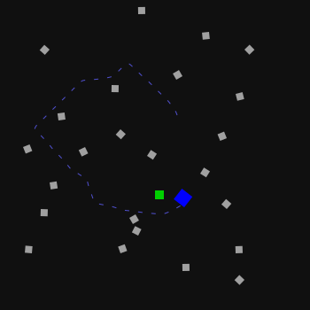

## Solving part of the FRA pcap challenge 2021-09 using fq

**CAUTION:** fq is still in early development so things might change but i will try to keep the guide updated.

This guide will show how to work with fq and how to use the jq language. It will also show some useful things from the standard library of jq and fq. We will walk thru one of the challenges from [FRA challenge](https://challenge.fra.se/) that are challenges [FRA](https://www.fra.se/) (~Swedish NSA) published as part of their recruitment effort. The challenge can be downloaded from [pcap-challenge-2021-09.tgz](https://challenge.fra.se/pcap-challenge-2021-09.tgz) but it can also be found in the same directory as this README file.

Start by running fq on the file to get an overview:

```
$ fq . pcap-challenge-2021-09.tgz
         │00 01 02 03 04 05 06 07 08 09 0a 0b 0c 0d 0e 0f│0123456789abcdef│.{}: pcap-challenge-2021-09.tgz (gzip)
0x0000000│1f 8b                                          │..              │  identification: raw bits (valid)
0x0000000│      08                                       │  .             │  compression_method: "deflate" (8)
0x0000000│         00                                    │   .            │  flags{}:
0x0000000│            00 00 00 00                        │    ....        │  mtime: 0
0x0000000│                        00                     │        .       │  extra_flags: 0
0x0000000│                           03                  │         .      │  os: "Unix" (3)
 0x000000│74 72 69 61 6e 67 6c 65 2e 70 63 61 70 00 00 00│triangle.pcap...│  uncompressed{}: (tar)
 *       │until 0x4fafff.7 (end) (5222400)               │                │
0x0000000│                              ec 9c 09 90 1c d5│          ......│  compressed: raw bits
0x0000010│79 c7 47 2b a1 15 42 c8 40 44 02 8b 84 57 4b 62│y.G+..B.@D...WKb│
*        │until 0x3b602.7 (243193)                       │                │
0x003b600│         1e 41 08 b4                           │   .A..         │  crc32: 0xb408411e (valid)
0x003b600│                     00 b0 4f 00│              │       ..O.│    │  isize: 5222400
```

The first columns shows the start address of each line, second and third a hex and ASCII dump and the forth a hierarchical tree representation of the decoded values. At the top we see that the file was detected as `gzip`. The tree shows various compression details and that fq has detected that the uncompressed bytes are a `tar` archive, also the `{}` hints that there are more values inside the uncompressed field.

Of course it's probably easiest to just extract the archive instead using fq but for the case of learning it's probably useful to use something familiar to show how to navigate it using fq.

Now start an interactive [REPL](https://en.wikipedia.org/wiki/Read%E2%80%93eval%E2%80%93print_loop) (`-i`):
```
$ fq -i . pcap-challenge-2021-09.tgz
gzip>
```

The First thing we see is a prompt indicating the current "input" which is the root of the gzip file. If we type `.`, it will show the same output as above. `.` is the "identity" function in jq which does nothing, it just outputs what it gets as input. By default fq:s REPL will try to display what the expression is evaluated to in some useful way.

To recursively display the whole tree we can use `d` (short for `display`) or `f` (short for `display({array_truncate: 0})`) which will do the same but not truncate long arrays.

Note that the REPL supports auto-completion of functions and fields using tab, there is history support using arrow keys and the prompt supports basic readline shortcuts (same as bash etc).

To look into the tar archive we can do:

```
gzip> .uncompressed
        │00 01 02 03 04 05 06 07 08 09 0a 0b 0c 0d 0e 0f│0123456789abcdef│.uncompressed{}: (tar)
0x000000│74 72 69 61 6e 67 6c 65 2e 70 63 61 70 00 00 00│triangle.pcap...│  files[0:3]:
0x000010│00 00 00 00 00 00 00 00 00 00 00 00 00 00 00 00│................│
*       │until 0x4f9dff.7 (5217792)                     │                │
0x4f9e00│00 00 00 00 00 00 00 00 00 00 00 00 00 00 00 00│................│  end_marker: raw bits
0x4f9e10│00 00 00 00 00 00 00 00 00 00 00 00 00 00 00 00│................│
*       │until 0x4fafff.7 (end) (4608)                  │                │
```

`files[0:3]` mean that `files` is an array with 3 values, shown using the jq "slice" syntax `start:end`.

To look at the first file we can use:

```
gzip> .uncompressed.files[0]
        │00 01 02 03 04 05 06 07 08 09 0a 0b 0c 0d 0e 0f│0123456789abcdef│.uncompressed.files[0]{}:
0x000000│74 72 69 61 6e 67 6c 65 2e 70 63 61 70 00 00 00│triangle.pcap...│  name: "triangle.pcap"
*       │until 0x63.7 (100)                             │                │
0x000060│            30 30 30 30 36 34 34 00            │    0000644.    │  mode: 420 ("0000644")
0x000060│                                    30 30 30 30│            0000│  uid: 0 ("0000000")
0x000070│30 30 30 00                                    │000.            │
0x000070│            30 30 30 30 30 30 30 00            │    0000000.    │  gid: 0 ("0000000")
0x000070│                                    30 30 30 32│            0002│  size: 5207688 ("00023673210")
0x000080│33 36 37 33 32 31 30 00                        │3673210.        │
0x000080│                        31 34 31 30 35 32 31 35│        14105215│  mtime: 1628773280 ("14105215640")
0x000090│36 34 30 00                                    │640.            │
0x000090│            30 31 32 32 34 32 00 20            │    012242.     │  chksum: 5282 ("012242")
0x000090│                                    30         │            0   │  typeflag: "0"
0x000090│                                       00 00 00│             ...│  linkname: ""
0x0000a0│00 00 00 00 00 00 00 00 00 00 00 00 00 00 00 00│................│
*       │until 0x100.7 (100)                            │                │
0x000100│   75 73 74 61 72 20                           │ ustar          │  magic: "ustar"
0x000100│                     20 00                     │        .       │  version: " "
0x000100│                           72 6f 6f 74 00 00 00│         root...│  uname: "root"
0x000110│00 00 00 00 00 00 00 00 00 00 00 00 00 00 00 00│................│
0x000120│00 00 00 00 00 00 00 00 00                     │.........       │
0x000120│                           72 6f 6f 74 00 00 00│         root...│  gname: "root"
0x000130│00 00 00 00 00 00 00 00 00 00 00 00 00 00 00 00│................│
0x000140│00 00 00 00 00 00 00 00 00                     │.........       │
0x000140│                           00 00 00 00 00 00 00│         .......│  devmajor: ""
0x000150│00                                             │.               │
0x000150│   00 00 00 00 00 00 00 00                     │ ........       │  devminor: ""
0x000150│                           00 00 00 00 00 00 00│         .......│  prefix: ""
0x000160│00 00 00 00 00 00 00 00 00 00 00 00 00 00 00 00│................│
*       │until 0x1f3.7 (155)                            │                │
0x0001f0│            00 00 00 00 00 00 00 00 00 00 00 00│    ............│  header_block_padding: raw bits (all zero)
0x000200│d4 c3 b2 a1 02 00 04 00 00 00 00 00 00 00 00 00│................│  data{}: (pcap)
*       │until 0x4f7887.7 (5207688)                     │                │
0x4f7880│                        00 00 00 00 00 00 00 00│        ........│  data_block_padding: raw bits (all zero)
0x4f7890│00 00 00 00 00 00 00 00 00 00 00 00 00 00 00 00│................│
*       │until 0x4f79ff.7 (376)                         │                │
```

It seems to be a PCAP file. To iterate and display all file names we caN do:

```
gzip> .uncompressed.files[].name
    │00 01 02 03 04 05 06 07 08 09 0a 0b 0c 0d 0e 0f│0123456789abcdef│
0x00│74 72 69 61 6e 67 6c 65 2e 70 63 61 70 00 00 00│triangle.pcap...│.uncompressed.files[0].name: "triangle.pcap"
*   │until 0x63.7 (100)                             │                │
        │00 01 02 03 04 05 06 07 08 09 0a 0b 0c 0d 0e 0f│0123456789abcdef│
0x4f7a00│74 72 69 61 6e 67 6c 65 73 2e 70 79 00 00 00 00│triangles.py....│.uncompressed.files[1].name: "triangles.py"
*       │until 0x4f7a63.7 (100)                         │                │
        │00 01 02 03 04 05 06 07 08 09 0a 0b 0c 0d 0e 0f│0123456789abcdef│
0x4f9a00│52 45 41 44 4d 45 2e 74 78 74 00 00 00 00 00 00│README.txt......│.uncompressed.files[2].name: "README.txt"
*       │until 0x4f9a63.7 (100)                         │                │
```

This uses the jq "each" operator `[]` which will output all values in an array (or object), then we use `.name` on each output to get the name.

If we want to access just the name and not display the hexdump columns etc, we can use the "pipe" operator and filter each value thru `tovalue` which will convert it into some JSON compatible.

```
gzip> .uncompressed.files[].name | tovalue
"triangle.pcap"
"triangles.py"
"README.txt"
```

Or if we want to have the names in an array:

```
gzip> [.uncompressed.files[].name]
[
  "triangle.pcap",
  "triangles.py",
  "README.txt"
]
```

Here we use the `[...]` array constructor which will collect all outputs from the expression between the brackets. `tovalue` is not needed in this case as the `.name` decode values in the array knows how to behave as JSON values. But note that the values still are decode values. Consider the difference:

```
gzip> [.uncompressed.files[].name][1]
        │00 01 02 03 04 05 06 07 08 09 0a 0b 0c 0d 0e 0f│0123456789abcdef│
0x4f7a00│74 72 69 61 6e 67 6c 65 73 2e 70 79 00 00 00 00│triangles.py....│.uncompressed.files[1].name: "triangles.py"
*       │until 0x4f7a63.7 (100)                         │                │
gzip> [.uncompressed.files[].name | tovalue][1]
"triangles.py"
```

As a side note jq's standard library has a `map` function that does exactly this `.uncompressed.files | map(.name)`. To learn more one can look at [how map is implemented](https://github.com/stedolan/jq/blob/master/src/builtin.jq), look for `def map(f):`.

Back to the challenge and have a look at content of the `README.txt` file:

```
gzip> .uncompressed.files[2].data | println
FRA Pcap Challenge 2021-09
==========================

1. Spara skärmdump av rymdskeppet
2. Spara skärmdump av när skeppet flyger runt
3. Spara skärmdump av en sten och en blomma
4. Spara en skärmdump som täcker hela området som skeppet flugit

Lycka till!
```

It's instructions in Swedish telling us to take various screenshots of a space ship flying around in space.

Here we used `println` which convert it's input to a string and prints it to stdout (and outputs nothing, more on that later).

Let's have a look at the PCAP file:

```
gzip> .uncompressed.files[0].data
        │00 01 02 03 04 05 06 07 08 09 0a 0b│0123456789ab│.uncompressed.files[0].data{}: (pcap)
0x0001f8│                        d4 c3 b2 a1│        ....│  magic: "little_endian" (0xd4c3b2a1) (valid)
0x000204│02 00                              │..          │  version_major: 2
0x000204│      04 00                        │  ..        │  version_minor: 4
0x000204│            00 00 00 00            │    ....    │  thiszone: 0
0x000204│                        00 00 00 00│        ....│  sigfigs: 0
0x000210│00 00 04 00                        │....        │  snaplen: 262144
0x000210│            71 00 00 00            │    q...    │  network: "linux_sll" (113) (Linux "cooked" capture encapsulation)
0x000210│                        92 1a 15 61│        ...a│  packets[0:5705]:
0x00021c│7a e4 07 00 4c 00 00 00 4c 00 00 00│z...L...L...│
*       │until 0x4f7887.7 (5207664)         │            │
        │                                   │            │  ipv4_reassembled[0:0]:
        │                                   │            │  tcp_connections[0:1]:
```

It has 5705 captured packets, no IPv4 fragments and there was one reassembled TCP connection.

First time I ran fq on this pcap it could not decode much as it did not support "linux_ssl". It was not that much work to add support, which is a reminder that if fq does not support something it might not be that far away from supporting it.

Now have a look at the streams from the TCP connection:

```
gzip> .uncompressed.files[0].data.tcp_connections[0]
         │00 01 02 03 04 05 06 07 08 09 0a 0b 0c 0d 0e 0f│0123456789abcdef│.uncompressed.files[0].data.tcp_connections[0]{}:
 0x000000│7a 7a 7a 6d 6d 6d 6d 6d 6d 6d 6d 6d 6d 6d 6d 6d│zzzmmmmmmmmmmmmm│  client_stream: raw bits
 *       │until 0x31e.7 (end) (799)                      │                │
 0x000000│7b 22 6d 73 67 5f 74 79 70 65 22 3a 20 22 63 6f│{"msg_type": "co│  server_stream: raw bits
 *       │until 0x48234c.7 (end) (4727629)               │                │
         │                                               │                │  source_ip: "127.0.0.1"
         │                                               │                │  source_port: 57040
         │                                               │                │  destination_ip: "127.0.0.1"
         │                                               │                │  destination_port: 4372
```

Looks like the client sent lots of "z" and "m ", maybe key strokes to control a ship? The server has responded with something that looks like 4727629 bytes of JSON. it's probably a bad idea to display the whole string, let's show the first 2000 bytes as a string.

```
gzip> .uncompressed.files[0].data.tcp_connections[0].server_stream[0:2000]
"{\"msg_type\": \"code\", \"encoding\": \"ascii\", \"data\": \"class Player(Object):\\n    def __init__(self, x, y):\\n
Object.__init__(self, x, y)\\n\\n        self.MAX_ROTATION_SPEED=7\\n        self.MAX_SPEED=0.1\\n        self.MAX_THRUS
T=0.01\\n        self.SPEED_REDUCTION=1.01\\n\\n    d
ef render(self, buf, center_x, center_y):\\n        self.buf=buf\\n        self.img=Image.new(mode='RGB', size=(IMAGE_RE
SOLUTION['X'], IMAGE_RESOLUTION['Y']))\\n\\n
     d=ImageDraw.Draw(self.img)\\n\\n        d.polygon(((IMAGE_RESOLUTION['X']/2, IMAGE_RESOLUTION['Y']/2-50),
              (IMAGE_RESOLUTION['X']/2+25, IMAGE_RESOLUTION
['Y']/2+50),                   (IMAGE_RESOLUTION['X']/2, IMAGE_RESOLUTION['Y']/2+20),                   (IMAGE_RESOLUTIO
N['X']/2-25, IMAGE_RESOLUTION['Y']/2+50),
    ),                 outline='green', fill='cyan')\\n\\n        self.image2ascii(self.img, self.game2image(self.x, sel
f.y, center_x, center_y))\\n        return self
.buf\\n    \", \"md5\": \"5997afe4ac36467ffa0b4a7875a3627a\"}\n{\"msg_type\": \"code\", \"encoding\": \"long_xor\", \"da
ta\": \"241e00051a542b290c194b2a251804151d5d434c4f52434523170756362b102806063c3a6f01041a0f58593e43521a4967110e1a06060a7b
3455041722170f5145545e31071b1700602f4d56191b10281b015e3e74474d47594455775d424f5477424d415c584076325b596f6752415649545966
2010090024064f29361d172f1b2d3c4d34170d104554016a4f0b4a6f67524156495459661c170f0369020e1f07000a7b1f1d0a0b33016b5649545966
4f524316221e07580a1b15291d015e06281e0e041a7e59664f524345675212130512573400065e17261c0519045a0b2701160a0b335a515a5a41406f
65784345675205130f540b23011606176f01041a0f5859241a144f4524170f020c06263e4352000029060404360d507c655243456752415649071c2a
095c0110214f03030f7e59664f524345675212130512572f02155e2c2a130613471a1c31471f0c01224f46242e365e6a4f010a1f224f493f24353e03
30202636083e3422203b371d482a44386b52283b28333c193d37302a0b27353f263a226136553e4c6e786b56495459664f5243017a3b0c170e113d34
0e054d213513165e1a111520411b0e026e786b7c495459664f524345241d0e040d07441d473b2e2400373e242c27360a3a262a2a0"
```

We use the slice syntax to slice from character 0 to 2000. We use the word characters (UTF-8 codepoints) here as raw bits are by default represented as strings in fq. To get access to raw bits there are functions like `tobytes` etc.

There are two `{"msg_type": ... }` and the first one ends with `... }\n` so it's probably JSON lines. Let's split on `\n` and have a look:

```
gzip> .uncompressed.files[0].data.tcp_connections[0].server_stream | split("\n") | .[0,1,-2,-1]
"{\"msg_type\": \"code\", \"encoding\": \"ascii\", \"data\": \"class Player(Object):\\n    def __init__(self, x, y):\\n        Object.__init__(self, x, y)\\n\\n        self.MAX_ROTATION_SPEED=7\\n        self.MAX_SPEED=0.1\\n        self.MAX_THRUST=0.01\\n        self.SPEED_REDUCTION=1.01\\n\\n    def render(self, buf, center_x, center_y):\\n        self.buf=buf\\n        self.img=Image.new(mode='RGB', size=(IMAGE_RESOLUTION['X'], IMAGE_RESOLUTION['Y']))\\n\\n        d=ImageDraw.Draw(self.img)\\n\\n        d.polygon(((IMAGE_RESOLUTION['X']/2, IMAGE_RESOLUTION['Y']/2-50),                   (IMAGE_RESOLUTION['X']/2+25, IMAGE_RESOLUTION['Y']/2+50),                   (IMAGE_RESOLUTION['X']/2, IMAGE_RESOLUTION['Y']/2+20),                   (IMAGE_RESOLUTION['X']/2-25, IMAGE_RESOLUTION['Y']/2+50),                  ),                 outline='green', fill='cyan')\\n\\n        self.image2ascii(self.img, self.game2image(self.x, self.y, center_x, center_y))\\n        return self.buf\\n    \", \"md5\": \"5997afe4ac36467ffa0b4a7875a3627a\"}"
"{\"msg_type\": \"code\", \"encoding\": \"long_xor\", \"data\": \"241e00051a542b290c194b2a251804151d5d434c4f52434523170756362b102806063c3a6f01041a0f58593e43521a4967110e1a06060a7b3455041722170f5145545e31071b1700602f4d56191b10281b015e3e74474d47594455775d424f5477424d415c584076325b596f67524156495459662010090024064f29361d172f1b2d3c4d34170d104554016a4f0b4a6f67524156495459661c170f0369020e1f07000a7b1f1d0a0b33016b56495459664f524316221e07580a1b15291d015e06281e0e041a7e59664f524345675212130512573400065e17261c0519045a0b2701160a0b335a515a5a41406f65784345675205130f540b23011606176f01041a0f5859241a144f4524170f020c06263e4352000029060404360d507c655243456752415649071c2a095c0110214f03030f7e59664f524345675212130512572f02155e2c2a130613471a1c31471f0c01224f46242e365e6a4f010a1f224f493f24353e0330202636083e3422203b371d482a44386b52283b28333c193d37302a0b27353f263a226136553e4c6e786b56495459664f5243017a3b0c170e113d340e054d213513165e1a111520411b0e026e786b7c495459664f524345241d0e040d07441d473b2e2400373e242c27360a3a262a2a0929462e4e29567444130e152b580c171d1c5735061c4b172616485a203938012a2d3120143d2d233d3d360834553a421a5d535b0819092a451f02112f5c02191a5c0b270b5b4a45211d13564106182243130e152b5b411f0754032f1f5a380c6d404b1b080011681f1b4c09221c49050c181f681f1d0a0b330148560f1b0b6606520a0b670000180e11512a0a1c4b16221e0758191b10281b014a4c1a5e41050c181f681f1d0a0b3301482b637e59664f52434567520558191b153f081d0d4d241d0e040d0755664f52434567524156495459664f5243452807151a001a1c7b1c170f0369110e1a06060a1d5f2f4f45211b0d1a54071c2a095c000a2b1d1305324524664678696f67524156495459661c170f03691b0c170e114b271c110a0c6f01041a0f5a102b085e4316221e07580e1514235d1b0e04201749050c181f68175e4316221e0758105859250a1c1700352d195a49171c281b17113a3e5b487c495459664f524345351715031b1a59350a1e054b2507077c635459664f\", \"md5\": \"e9514a2de33051b9c6174d31e35b7584\"}"
"{\"msg_type\": \"update\", \"encoding\": \"ascii\", \"data\": \"{\\\"id\\\": 1, \\\"type\\\": \\\"Player\\\", \\\"x\\\": 253.65325300861684, \\\"y\\\": 352.330474276039, \\\"rot\\\": 308}\", \"md5\": \"caa8fb32ac8426f29d32da8c46b843ad\"}"
""
```

`split("\n")` splits a string on some boundary, "\n" in this case, and output AN array with all the parts. We then use `.[0,1,-2,-1]` to get the first, second, second from the end and last string from the array (negative indexes counts from the end).

Here we VERB MISSING the output operator `,` which is a way in jq to return or "output" more than one value. What happens is that for each value `0`,`1`, `-2` and `-1` the program "forks" and continueS to run and then aT some point it will "backtrack" back to THE next value and so on. To learn more one can read all about it on
[jq internals](https://github.com/stedolan/jq/wiki/Internals%3A-backtracking).

This is also how jq arrays are expressed, remember `[...]`? let's try `[0,1,-2,-1]`:

```
gzip> [0,1,-2,-1]
[
  0,
  1,
  -2,
  -1
]
```

`[...]` "collects" the output from the expression `0,1-2,-1` and to show that what is inside the brackets is just an expression we can do:

```
gzip> [(0,(1,2))]
[
  0,
  1,
  2
]
```

and to go full circle we can use a multiple output expression as a array index:

```
gzip> [1,2,3][0,1,2]
1
2
3
```

first we build an array by collecting `1,2,3` and then we index into it using `0,1,2`, getting the values at index `0`, `1` and `2`.

Now back to the JSON lines. We see that the last is just an empty string, probably because the streams end with a new line. Let's filter it out, convert the other lines into useable values and then make things a bit more comfortable by starting a new REPL.

```
gzip> .uncompressed.files[0].data.tcp_connections[0].server_stream | split("\n") | map(select(. != "") | fromjson) | repl
> [object, ...][13842][]>
```

We `map` here to do something for each line. `select` is A function that given a condition will output its input or otherwise it will return `empty`, in this case removing all empty strings. Then we pipe all the non-empty lines to `fromjson`, which converts JSON represention into a jq value. Lastly we pipe the result to `repl`, which will start a new nested REPL.

The prompt tells us that the input is an array with 13842 values, the first value is an object.

Let's have look using `.[0,1,-2,-1]` again. `.` here is the current input.

```
> [object, ...][13842][]> .[0,1,-2,-1]
{
  "data": "class Player(Object):\n    def __init__(self, x, y):\n        Object.__init__(self, x, y)\n\n        self.MAX_ROTATION_SPEED=7\n        self.MAX_SPEED=0.1\n        self.MAX_THRUST=0.01\n        self.SPEED_REDUCTION=1.01\n\n    def render(self, buf, center_x, center_y):\n        self.buf=buf\n        self.img=Image.new(mode='RGB', size=(IMAGE_RESOLUTION['X'], IMAGE_RESOLUTION['Y']))\n\n        d=ImageDraw.Draw(self.img)\n\n        d.polygon(((IMAGE_RESOLUTION['X']/2, IMAGE_RESOLUTION['Y']/2-50),                   (IMAGE_RESOLUTION['X']/2+25, IMAGE_RESOLUTION['Y']/2+50),                   (IMAGE_RESOLUTION['X']/2, IMAGE_RESOLUTION['Y']/2+20),                   (IMAGE_RESOLUTION['X']/2-25, IMAGE_RESOLUTION['Y']/2+50),                  ),                 outline='green', fill='cyan')\n\n        self.image2ascii(self.img, self.game2image(self.x, self.y, center_x, center_y))\n        return self.buf\n    ",
  "encoding": "ascii",
  "md5": "5997afe4ac36467ffa0b4a7875a3627a",
  "msg_type": "code"
}
{
  "data": "241e00051a542b290c194b2a251804151d5d434c4f52434523170756362b102806063c3a6f01041a0f58593e43521a4967110e1a06060a7b3455041722170f5145545e31071b1700602f4d56191b10281b015e3e74474d47594455775d424f5477424d415c584076325b596f67524156495459662010090024064f29361d172f1b2d3c4d34170d104554016a4f0b4a6f67524156495459661c170f0369020e1f07000a7b1f1d0a0b33016b56495459664f524316221e07580a1b15291d015e06281e0e041a7e59664f524345675212130512573400065e17261c0519045a0b2701160a0b335a515a5a41406f65784345675205130f540b23011606176f01041a0f5859241a144f4524170f020c06263e4352000029060404360d507c655243456752415649071c2a095c0110214f03030f7e59664f524345675212130512572f02155e2c2a130613471a1c31471f0c01224f46242e365e6a4f010a1f224f493f24353e0330202636083e3422203b371d482a44386b52283b28333c193d37302a0b27353f263a226136553e4c6e786b56495459664f5243017a3b0c170e113d340e054d213513165e1a111520411b0e026e786b7c495459664f524345241d0e040d07441d473b2e2400373e242c27360a3a262a2a0929462e4e29567444130e152b580c171d1c5735061c4b172616485a203938012a2d3120143d2d233d3d360834553a421a5d535b0819092a451f02112f5c02191a5c0b270b5b4a45211d13564106182243130e152b5b411f0754032f1f5a380c6d404b1b080011681f1b4c09221c49050c181f681f1d0a0b330148560f1b0b6606520a0b670000180e11512a0a1c4b16221e0758191b10281b014a4c1a5e41050c181f681f1d0a0b3301482b637e59664f52434567520558191b153f081d0d4d241d0e040d0755664f52434567524156495459664f5243452807151a001a1c7b1c170f0369110e1a06060a1d5f2f4f45211b0d1a54071c2a095c000a2b1d1305324524664678696f67524156495459661c170f03691b0c170e114b271c110a0c6f01041a0f5a102b085e4316221e07580e1514235d1b0e04201749050c181f68175e4316221e0758105859250a1c1700352d195a49171c281b17113a3e5b487c495459664f524345351715031b1a59350a1e054b2507077c635459664f",
  "encoding": "long_xor",
  "md5": "e9514a2de33051b9c6174d31e35b7584",
  "msg_type": "code"
}
{
  "data": "3c652e23657d6776777077757e6b6765333e3722657d6765012b28302235656b67653f657d6775747769776b67653e657d6774737769776b6765352833657d67773a",
  "encoding": "xor",
  "md5": "a80484425bfb3c32a6108ac3d37bd3b8",
  "msg_type": "update"
}
{
  "data": "{\"id\": 1, \"type\": \"Player\", \"x\": 253.65325300861684, \"y\": 352.330474276039, \"rot\": 308}",
  "encoding": "ascii",
  "md5": "caa8fb32ac8426f29d32da8c46b843ad",
  "msg_type": "update"
}
```

Looks like nested JSON and some of the values are encrypted.

Maybe we can get some overview by filtering out things that seems to change in each message and see what is left:

```
> [object, ...][13842]> count_by(del(.md5) | del(.data))
[
  [
    {
      "encoding": "ascii",
      "msg_type": "code"
    },
    1
  ],
  [
    {
      "encoding": "ascii",
      "msg_type": "update"
    },
    708
  ],
  [
    {
      "encoding": "long_xor",
      "msg_type": "code"
    },
    2
  ],
  [
    {
      "encoding": "xor",
      "msg_type": "update"
    },
    13131
  ]
]
```

Here we use `count_by` which is a fq function similar to the jq function `unique_by` but instead of groping all unique values it just counts them, returning an array with `[unique value, count]` pairs. In jq `_by` is convension used by some functions to allow ad-hoc transform something before using it. For example `count` count number of unique values but `count_by` will count unique values after from transformation, in this case the transformation `del(.md5) | del(.data)` which will remove the keys `md5` and `data` from an object.

How does the first two "xor" encoded messages looks like:

```
> [object, ...][0:13842]> map(select(.encoding == "xor")) | .[0:2]
[
  {
    "data": "3c652e23657d6774757e7f767f6b6765333e3722657d67651528242c656b67653f657d67757e776b67653e657d677671776b6765352833657d677f736b676524282b283534657d671c652035222229656b6765302f2e3322651a6b676537282e293334657d671c74776b6773776b6773776b6776776b6773771a3a",
    "encoding": "xor",
    "md5": "2074c8a4effcbaa0ceec11754cfa66c3",
    "msg_type": "update"
  },
  {
    "data": "3c652e23657d67717373707f736b6765333e3722657d67651528242c656b67653f657d677474776b67653e657d67767f776b6765352833657d677476716b676524282b283534657d671c652035222229656b6765302f2e3322651a6b676537282e293334657d671c74776b6773776b6773776b6776776b6773771a3a",
    "encoding": "xor",
    "md5": "8f772df87dd20c5a41109b6ed84efb46",
    "msg_type": "update"
  }
]
```

The common `3c652e23657d67` prefix is suspicious and looks hex encoded and probably some encrypted form of `{"id": ` judging by how other "update" messages look. There was "long_xor" so maybe this is just per byte xor? XOR is symmetric so we should get the key if we encrypt some known plaintext with its encrypted version.

```
> [object, ...][13842]> bxor(("{" | explode)[0]; ("3c" | hex | explode)[0])
71
```

`explode` is a jq functions that turn a string into an array of its codepoints. `hex` decodes a hex string into a bytes buffer but we use it as string here. We then bitwise XOR using `bxor` and get the key `71`.

Notice that jq uses the argument separator `;` not `,`.

Now try bitwise XOR all codepoints with `71`:

```
> [object, ...][13842]> .[-2].data | hex | explode | map(bxor(.; 71)) | implode
"{\"id\": 107029, \"type\": \"Flower\", \"x\": 230.0, \"y\": 340.0, \"rot\": 0}"
```

Ok that looks like JSON to me. Now let's have a look at "long_xor" with "msg_type" "code", maybe it starts with `class `?.

```
> [object, ...][13842]> ["class " | explode, ("241e00051a54" | hex | explode)] | transpose | map(bxor(.[0]; .[1])) | implode
"Gravit"
```

That looks like it could be a start of a key. I noticed earlier while poking around that the hex decoded data for a "code" message has parts that looks like english text.

```
> [object, ...][0:13842]> .[1].data | hex | tostring | scan("\\w*force\\w*"; "i")
"YfORCEgR"
"YfORCEgR"
"ITYfORCE"
"YfORCEgR"
"UfORCEgRAVITYfORCE"
"ITYfORCE5"
```

`scan` is jq function that outputs all non-overlapping strings matching a regexp. `"i"` is to match case-insensitive.

A good guess is probably that the key is `"GravityForce"` repeated. Why it shows up and have weird casing is probably because the plain text has long streaks of whitespace `0x32` which happens to be the bit in encoding ASCII encoding changing between upper/lower case.

Let's try decrypt it using it:

```
> [object, ...][13842]> .[1].data | hex | [., ("GravityForce"*100)[0:length]] | map(explode) | transpose | map(bxor(.[0]; .[1])) | implode
"class Rock(Object):\n    def __init__(self, x, y, colors=['green', 'white'], points=[35,100,120,100,75,90]):\n        Object.__init__(self, x, y)\n        self.points=points\n        self.colors=colors\n        self.rot=random.randint(0,359)\n\n    def render(self, buf, center_x, center_y):\n        self.buf=buf\n        self.img=Image.new(mode='RGB', size=(IMAGE_RESOLUTION['X'], IMAGE_RESOLUTION['Y']))\n\n        d=ImageDraw.Draw(self.img)\n\n\n        coords=[(IMAGE_RESOLUTION['X']/2+ampl*math.sin(rad),IMAGE_RESOLUTION['Y']/2-ampl*math.cos(rad)) for (rad,ampl) in zip([i*2*math.pi/len(self.points) for i in range(len(self.points))], self.points)]\n\n        d.polygon(coords,                 outline=self.colors[0], fill=self.colors[1] )\n\n\n        self.image2ascii(self.img, self.game2image(self.x, self.y, center_x, center_y))\n        return self.buf\n\n    "
```

Looks like python to me.

`("GravityForce"*100)[0:length]` is a quick trick to make sure the key is repeated and has the same length as the encrypted message. `length` is a function that returns the length of its input.

Now decrypt all data strings and use `fromjson` again and start a new REPL:

```
> [object, ...][0:13842]> map(if .encoding == "xor" then .data |= (hex | explode | map(bxor(.; 71)) | implode) elif .encoding == "long_xor" then .data |= (hex | [., ("GravityForce"*100)[0:length]] | map(explode) | transpose | map(bxor(.[0]; .[1])) | implode) end | if .msg_type == "update" then .data |= fromjson end) | repl
>> [object, ...][0:13842]>
```

We can break this down a bit:
```
map(
  ( if .encoding == "xor" then
      .data |= (hex | explode | map(bxor(.; 71)) | implode)
    elif .encoding == "long_xor" then
      .data |= (hex | [., ("GravityForce"*100)[0:length]] | map(explode) | transpose | map(bxor(.[0]; .[1])) | implode)
    end
  | if .msg_type == "update" then .data |= fromjson end
  )
) | repl
```

TODO: break this down more

A few new things here. `if` is A plain old if-statement, conditionally do something, that can have optional `elif`/`else` branches. `.key |= ...` is a shorthand for `.key = (.key | ...)` which will update a keys value in an object using the current value as input.

Now have a look at `.[0,1,-2,-1]` again:

```
>> [object, ...][0:13842]> .[0,1,-2,-1]
{
  "data": "class Player(Object):\n    def __init__(self, x, y):\n        Object.__init__(self, x, y)\n\n        self.MAX_ROTATION_SPEED=7\n        self.MAX_SPEED=0.1\n        self.MAX_THRUST=0.01\n        self.SPEED_REDUCTION=1.01\n\n    def render(self, buf, center_x, center_y):\n        self.buf=buf\n        self.img=Image.new(mode='RGB', size=(IMAGE_RESOLUTION['X'], IMAGE_RESOLUTION['Y']))\n\n        d=ImageDraw.Draw(self.img)\n\n        d.polygon(((IMAGE_RESOLUTION['X']/2, IMAGE_RESOLUTION['Y']/2-50),                   (IMAGE_RESOLUTION['X']/2+25, IMAGE_RESOLUTION['Y']/2+50),                   (IMAGE_RESOLUTION['X']/2, IMAGE_RESOLUTION['Y']/2+20),                   (IMAGE_RESOLUTION['X']/2-25, IMAGE_RESOLUTION['Y']/2+50),                  ),                 outline='green', fill='cyan')\n\n        self.image2ascii(self.img, self.game2image(self.x, self.y, center_x, center_y))\n        return self.buf\n    ",
  "encoding": "ascii",
  "md5": "5997afe4ac36467ffa0b4a7875a3627a",
  "msg_type": "code"
}
{
  "data": "class Rock(Object):\n    def __init__(self, x, y, colors=['green', 'white'], points=[35,100,120,100,75,90]):\n        Object.__init__(self, x, y)\n        self.points=points\n        self.colors=colors\n        self.rot=random.randint(0,359)\n\n    def render(self, buf, center_x, center_y):\n        self.buf=buf\n        self.img=Image.new(mode='RGB', size=(IMAGE_RESOLUTION['X'], IMAGE_RESOLUTION['Y']))\n\n        d=ImageDraw.Draw(self.img)\n\n\n        coords=[(IMAGE_RESOLUTION['X']/2+ampl*math.sin(rad),IMAGE_RESOLUTION['Y']/2-ampl*math.cos(rad)) for (rad,ampl) in zip([i*2*math.pi/len(self.points) for i in range(len(self.points))], self.points)]\n\n        d.polygon(coords,                 outline=self.colors[0], fill=self.colors[1] )\n\n\n        self.image2ascii(self.img, self.game2image(self.x, self.y, center_x, center_y))\n        return self.buf\n\n    ",
  "encoding": "long_xor",
  "md5": "e9514a2de33051b9c6174d31e35b7584",
  "msg_type": "code"
}
{
  "data": {
    "id": 107029,
    "rot": 0,
    "type": "Flower",
    "x": 230,
    "y": 340
  },
  "encoding": "xor",
  "md5": "a80484425bfb3c32a6108ac3d37bd3b8",
  "msg_type": "update"
}
{
  "data": {
    "id": 1,
    "rot": 308,
    "type": "Player",
    "x": 253.65325300861684,
    "y": 352.330474276039
  },
  "encoding": "ascii",
  "md5": "caa8fb32ac8426f29d32da8c46b843ad",
  "msg_type": "update"
}
```

Much better. So it's information what shapes to draw and position and rotation updates per object. Maybe try collect the final state for all objects so that we can draw an ending "screenshot"?

```
>> [object, ...][0:13842]> reduce (.[] | select(.msg_type == "update")) as $msg ({}; .[$msg.data.id | tostring] = $msg.data) | repl
>>> object> length
26
>>> object> map({type, x, y}) | first
{
  "type": "Player",
  "x": 253.65325300861684,
  "y": 352.330474276039
}
```

Here we use `reduce` which is a special expression to "accumulate" something, the syntax is `reduce <generator> as $var (<init>; <update>)`. As generator we select all "update" messages and let each output be named `$msg`, our init value is `{}` an empty object and for each messagee we update the object using the object id found in the message with the data for that message.

This should be enough to draw something. To make things a bit more manageable there is cleaned up version of all that also has some helper functions to generates a screenshot as a SVG file. It also shows how to use fq as a script interpreter.

TODO: how to create own functions?

Have a look at [pcap-challenge-2021-09.jq](pcap-challenge-2021-09.jq).

To run the script do something like this, assuming you have fq in `PATH`:

```
$ ./pcap-challenge-2021-09.jq pcap-challenge-2021-09.tgz > pcap-challenge-2021-09.svg
```

And it should produce this SVG as output:



